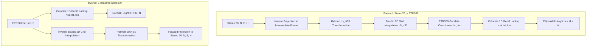

# Unified 3D SPG Grid Reference (`rom_grid3d_25.09.spg`)

This document provides a comprehensive technical specification of the unified 3D binary grid format (`.spg`) utilized by `pytransdatro` (and the official Romgeo application) for 2D and 3D coordinate transformations between **Stereo 70** (oblique stereographic projection / Krasovsky 1940 ellipsoid / Black Sea 1975 normal heights) and **ETRS89** (GRS80 ellipsoid / ellipsoidal heights).

> [!NOTE]
> As of the 2025.09 release, `pytransdatro` uses a single unified grid file `rom_grid3d_25.09.spg`. Legacy grid files (`.GRD`) have been retired. See [grids_obsolete.md](file:///d:/ProiecteRealizate/pyTransDatRO/repo/PyTransDatRO/docs/grids_obsolete.md) for details on the older binary formats.

---

## 1. Grid Overview & Provenance

The `.spg` file is a compiled binary serialization (serialized NumPy dictionary) created by **Centrul Național de Cartografie (CNC)**. It integrates both 2D horizontal distortion shifts and 1D vertical quasigeoid undulations into a single file.

- **File Name**: `rom_grid3d_25.09.spg`
- **File Location**: `pytransdatro/grids/rom_grid3d_25.09.spg`
- **File Size**: ~200.53 KB (205,347 bytes)
- **Author / Creator**: Centrul Național de Cartografie (CNC)
- **License**: Creative Commons Attribution-NoDerivatives 4.0 International (`CC BY-ND 4.0`)
- **Release Version**: `25.09` (Revision: 0, Date: `2025-10-20`)
- **Release Notes**: `release 2025.09; switched to colocate (0) interpolation for geoid_heights`

---

## 2. Build Parameters & Source Datasets (`params`)

The grid file embedding includes key build parameters, source file metadata, interpolation strategies, and 2D Helmert transformation parameters.

### 2.1 Source Data Files
- **`geodetic_shifts_file`**: `ETRS89_KRASOVSCHI42_2D.GRT`  
  Source 2D distortion table containing planimetric correction shifts ($dN, dE$) between ETRS89 and Krasovsky 1940 ellipsoids.
- **`geoid_heights_file`**: `RomHybQGeoid_CS1_5_MT3_MD80_4par_GNSS4h66.tif`  
  Source hybrid quasi-geoid model raster (RomHybQGeoid) representing height anomaly / undulation ($N$) relative to the Black Sea 1975 vertical datum.

### 2.2 Interpolation Strategies (`params.interpolation`)

| Dimension | Strategy Code | Method Name | Description & Usage |
|---|---|---|---|
| **Horizontal (2D)** | `2` | `INTERP_BICUBIC` | **Bicubic Spline**: Evaluated on a $4 \times 4$ node subgrid around the point to compute smooth, continuous planimetric $dN$ and $dE$ shifts. |
| **Vertical (1D)** | `0` | `INTERP_COLOCATE` | **Colocate (Nearest-Neighbor)**: Selects the closest single grid node value for the quasigeoid height anomaly ($N$) without polynomial smoothing. |

> [!IMPORTANT]
> The release notes explicitly document: *"switched to colocate (0) interpolation for geoid_heights"*.  
> `pytransdatro` respects this metadata by using nearest-neighbor lookup (`Grid1D.trans`) for elevation while using bicubic spline interpolation (`Grid2D.interp`) for planimetric shifts.

---

## 3. 2D Helmert Transformation Parameters (`params.helmert`)

The SPG file embeds the 4-parameter 2D conformal Helmert transformation constants used during the intermediate reprojection step between the pure Oblique Stereographic projection (`os`) space and the conformal Stereo 70 system (`st70`).

The 2D Helmert transformation applies the formula:
$$X_{\text{target}} = tE + (1 + dm \times 10^{-6}) \times (X \cos R_z - Y \sin R_z)$$
$$Y_{\text{target}} = tN + (1 + dm \times 10^{-6}) \times (X \sin R_z + Y \cos R_z)$$

### Embedded Parameters:

#### 1. Direction: `os_st70` (Oblique Stereographic $\rightarrow$ Stereo 70)
- **Translation East ($tE$)**: $+119.7358000\,\text{m}$
- **Translation North ($tN$)**: $+31.8051000\,\text{m}$
- **Scale Factor Correction ($dm$)**: $+0.11559991\,\text{ppm}$
- **Z-Axis Rotation ($R_z$)**: $-0.22739706\,\text{arcseconds}$

#### 2. Direction: `st70_os` (Stereo 70 $\rightarrow$ Oblique Stereographic)
- **Translation East ($tE$)**: $-119.7358000\,\text{m}$
- **Translation North ($tN$)**: $-31.8051000\,\text{m}$
- **Scale Factor Correction ($dm$)**: $-0.11559991\,\text{ppm}$
- **Z-Axis Rotation ($R_z$)**: $+0.22739706\,\text{arcseconds}$

---

## 4. Grid Layer 1: Geodetic Shifts (`grids.geodetic_shifts`)

This layer stores the 2D horizontal planimetric distortion corrections between ETRS89 and Stereo 70.

- **Layer Name**: `etrs89_krasovschi42`
- **CRS Type**: `grid` (Stereo 70 Metric Projected Coordinates)
- **Dimensions**: 2 dimensions (Band 0: $dN$ shift in meters, Band 1: $dE$ shift in meters)

### Extents & Resolution

| Parameter | Easting ($E$) | Northing ($N$) |
|---|---|---|
| **Minimum** | $109,783.040\,\text{m}$ | $213,634.564\,\text{m}$ |
| **Maximum** | $890,783.040\,\text{m}$ | $785,634.564\,\text{m}$ |
| **Coverage Span** | $781,000.0\,\text{m}$ ($781\,\text{km}$) | $572,000.0\,\text{m}$ ($572\,\text{km}$) |
| **Grid Step** | $11,000.0\,\text{m}$ ($11.0\,\text{km}$) | $11,000.0\,\text{m}$ ($11.0\,\text{km}$) |
| **Grid Matrix** | $72 \text{ Columns}$ | $53 \text{ Rows}$ |

- **Total Grid Nodes**: $3,816$ nodes ($72 \times 53$)
- **Valid Land Nodes**: $2,689$ nodes ($70.5\%$ coverage of Romanian territory)
- **NoData / NaN Nodes**: $1,127$ nodes (offshore / border margins)
- **Array Shape & Dtype**: `(2, 53, 72)` of `float32`

### Statistical Distribution

- **Northing Shift ($dN$)**: Min = $-2.4646\,\text{m}$, Max = $+2.2351\,\text{m}$, Mean = $+0.0103\,\text{m}$, Std = $0.2920\,\text{m}$
- **Easting Shift ($dE$)**: Min = $-4.3741\,\text{m}$, Max = $+1.6780\,\text{m}$, Mean = $-0.0080\,\text{m}$, Std = $0.4190\,\text{m}$

---

## 5. Grid Layer 2: Geoid Heights (`grids.geoid_heights`)

This layer stores the 1D vertical quasigeoid undulation / height anomaly ($N$) relative to the Black Sea 1975 normal height datum.

- **Layer Name**: `romhybqgeoid_cs1`
- **CRS Type**: `geodetic` (ETRS89 Ellipsoidal Coordinates, $\phi, \lambda$ in decimal degrees)
- **Dimensions**: 1 dimension (Band 0: Quasigeoid height $N$ in meters)

### Extents & Resolution

| Parameter | Longitude ($\lambda$) | Latitude ($\phi$) |
|---|---|---|
| **Minimum** | $20^\circ 04' 00.00''\,\text{E}$ ($20.066667^\circ$) | $43^\circ 32' 00.00''\,\text{N}$ ($43.533333^\circ$) |
| **Maximum** | $29^\circ 50' 00.00''\,\text{E}$ ($29.833333^\circ$) | $48^\circ 26' 00.00''\,\text{N}$ ($48.433333^\circ$) |
| **Coverage Span** | $9.766667^\circ$ | $4.900000^\circ$ |
| **Grid Step** | $0.033333^\circ$ ($2.0\text{ arcminutes}$) | $0.033333^\circ$ ($2.0\text{ arcminutes}$) |
| **Grid Matrix** | $293 \text{ Columns}$ | $147 \text{ Rows}$ |

- **Total Grid Nodes**: $43,071$ nodes ($293 \times 147$)
- **Valid Nodes**: $43,071$ nodes ($100.0\%$ complete coverage)
- **NoData / NaN Nodes**: $0$ nodes
- **Array Shape & Dtype**: `(1, 147, 293)` of `float32`

### Statistical Distribution

- **Quasigeoid Height ($N$)**: Min = $28.9964\,\text{m}$, Max = $46.3581\,\text{m}$, Mean = $37.6735\,\text{m}$, Std = $4.6883\,\text{m}$

---

## 6. Transformation Pipeline Integration in `pytransdatro`

In `pytransdatro`, grid loading and access is managed efficiently via three components:

1. **`SpgReader` (`pytransdatro/spg_reader.py`)**:  
   Acts as a thread-safe singleton. It loads `rom_grid3d_25.09.spg` once using `numpy.load(..., allow_pickle=True)` and caches flat 1D Python arrays (`shift_e_flat`, `shift_n_flat`, `height_flat`) and bounding metadata.
2. **`Grid2D` (`pytransdatro/trans_grid.py`)**:  
   Queries `shift_bounds` and performs 2D bicubic spline interpolation over a $4 \times 4$ subgrid of $dN$ and $dE$ shift values.
3. **`Grid1D` (`pytransdatro/trans_grid.py`)**:  
   Queries `height_bounds` and performs colocate (nearest-neighbor) indexing into `height_flat` to fetch the quasigeoid undulation $N$.

### Overall Workflow

