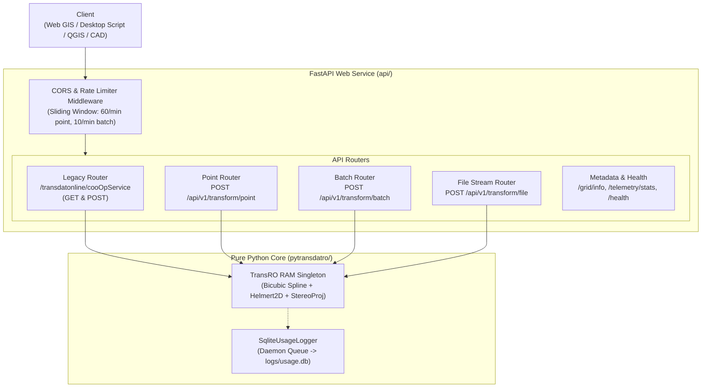

# PyTransDatRO REST API & Web Service Documentation

## 1. Overview & Architecture

The `api/` package provides a high-performance, asynchronous REST API service built on top of the pure Python `pytransdatro` geodetic library. It delivers:

1. **Modern Dual-Unit API (`/api/v1/...`)**: Fast, schema-validated JSON and streaming endpoints supporting both standard geodetic **radians** and **decimal degrees** for modern Web GIS integration.
2. **100% Backward Compatibility (`/transdatonline/cooOpService`)**: Byte-for-byte emulation of the 10+ year-old TransDatOnline/RomGeo Java servlet contract.
3. **High-Throughput File Streaming**: Line-by-line chunked streaming for delimited files (`.csv`, `.txt`) up to **100,000 points** per request.
4. **Sub-Millisecond In-Memory Execution**: The `.spg` grid is loaded into RAM once during server startup (singleton pattern). Transformations run in $< 0.05\text{ ms}$ per point without disk I/O.
5. **Non-Blocking SQLite Telemetry**: Integrates with `SqliteUsageLogger` under `source=2` (`rest_api`), recording daily volume metrics and non-sensitive ~1 km spatial density cells.
6. **Zero-Dependency Rate Limiter**: In-memory sliding-window limiter enforcing 60 req/min for point endpoints and 10 req/min for batch/file uploads per client IP.



---

## 2. Getting Started

### Installation
The core library has no web dependencies. To install the optional web service dependencies:

```bash
pip install -r requirements-api.txt
```
*(Dependencies: `fastapi`, `uvicorn`, `pydantic`, `python-multipart`, `httpx`).*

### Running the Service

#### Development Mode (with auto-reload):
```powershell
D:\anaconda3\envs\pytransdat\python.exe -m uvicorn api.main:app --host 0.0.0.0 --port 8000 --reload
```

#### Production Mode (multi-worker):
```bash
gunicorn api.main:app -w 4 -k uvicorn.workers.UvicornWorker --bind 0.0.0.0:8000
```
*Memory footprint:* $\approx 8\text{ MB}$ RAM per worker ($\approx 32\text{ MB}$ total for 4 workers).

### Interactive Documentation
Once started, visit:
- **Swagger UI**: [http://localhost:8000/docs](http://localhost:8000/docs)
- **ReDoc**: [http://localhost:8000/redoc](http://localhost:8000/redoc)

---

## 3. Endpoints Reference

### 3.1. Modern Transformation Endpoints (`/api/v1`)

#### `POST /api/v1/transform/point`
Transforms a single 2D or 3D coordinate.

* **Request Body** (`application/json`):
  ```json
  {
    "op": "Stereo70ToETRS89",
    "coos": [500000.0, 500000.0, 100.0],
    "unit": "degrees"
  }
  ```
  - `op`: `"Stereo70ToETRS89"` or `"ETRS89ToStereo70"`.
  - `coos`: `[N, E[, H]]` in meters for Stereo70, or `[Lat, Lon[, h]]` for ETRS89.
  - `unit`: `"radians"` (default) or `"degrees"`.
* **Response** (HTTP 200):
  ```json
  {
    "coos": [45.9997186280, 24.9984476351, 139.6084403992],
    "warning": null
  }
  ```
* **Out of Grid Response** (HTTP 200):
  ```json
  {
    "coos": [5.0, 1.0, 1.0],
    "warning": "Out of grid"
  }
  ```

---

#### `POST /api/v1/transform/batch`
Transforms an in-memory array of coordinates (up to 20,000 points) with per-point fault isolation.

* **Request Body** (`application/json`):
  ```json
  {
    "op": "Stereo70ToETRS89",
    "points": [
      [500000.0, 500000.0, 100.0],
      [5.0, 1.0, 1.0]
    ],
    "unit": "degrees"
  }
  ```
* **Response** (HTTP 200):
  ```json
  {
    "results": [
      {"coos": [45.9997186280, 24.9984476351, 139.6084403992], "warning": null},
      {"coos": [5.0, 1.0, 1.0], "warning": "Out of grid"}
    ],
    "count": 2
  }
  ```

---

#### `POST /api/v1/transform/file`
Streams transformations of an uploaded `.csv` or `.txt` file (up to 100,000 coordinate rows) using chunked HTTP transfer encoding.

* **Content-Type**: `multipart/form-data`
* **Form Fields**:
  - `file`: Uploaded file (max 20 MB).
  - `op`: `"Stereo70ToETRS89"` or `"ETRS89ToStereo70"`.
  - `unit`: `"radians"` or `"degrees"` (default: `"radians"`).
  - `delimiter`: `"auto"`, `"comma"`, `"semicolon"`, `"tab"`, `"space"` (default: `"auto"`).
* **Behavior**:
  - Automatically detects delimiter from first non-comment row when `auto` is set.
  - Strips empty lines and preserves `#` comment rows.
  - Returns streaming file attachment (`transformed_coordinates.csv`).
  - Lines outside grid are emitted with ` # Out of grid` appended.

---

### 3.2. Legacy Compatibility Endpoints

#### `GET /transdatonline/cooOpService` (and `/cooOpService`)
Maintains 100% backward compatibility with legacy scripts and QGIS plugins.

* **Query Parameters**:
  - `cooOp`: `"Stereo70ToETRS89"`, `"ETRS89ToStereo70"`, `"Stereo30ToETRS89"`, `"ETRS89ToStereo30"`.
  - `coos`: Semicolon-delimited numbers in **radians/meters** (e.g. `500000;500000;100`).
* **Responses** (HTTP 200):
  - **Success**: `{"coos": [0.8028465450500997, 0.43630521911977527, 139.60844039916992]}` *(warning omitted)*.
  - **Out of Grid**: `{"coos": [5.0, 1.0, 1.0], "warning": "Out of grid"}` *(coordinates echoed)*.
  - **Invalid Data**: `{"coos": [], "warning": "Invalid coordinate data"}`.
  - **Stereo 30**: `{"coos": [...], "warning": "Stereo30 transformation is obsolete and unsupported"}`.

#### `POST /transdatonline/cooOpService` (and `/cooOpService`)
Accepts both form-encoded data (`cooOp`, `coosArray`) and direct JSON bodies:
```json
{
  "cooOp": "ETRS89ToStereo70",
  "coosArray": [
    {"coos": [0.8028465450500996, 0.43630521911977493, 139.7825537763764]}
  ]
}
```
* **Response**: JSON array preserving order: `[{"coos": [500000.0, 500000.0, 100.174]}]`.

---

### 3.3. Metadata & Monitoring Endpoints

* **`GET /health`**: Returns health probe `{status: "healthy", grid_loaded: true, telemetry_active: true}`.
* **`GET /api/v1/grid/info`**: Returns active SPG file metadata, bounding box coordinates, and CRS definitions.
* **`GET /api/v1/telemetry/stats`**: Returns high-level daily call/point volume metrics from `logs/usage.db`.

---

## 4. Coordinate Conventions & Units

| Coordinate System | Type | Order | Units |
| :--- | :--- | :--- | :--- |
| **Stereo 70** | Projected Grid (EPSG:31700) | `[Northing, Easting[, H]]` | **Meters** ($m$) |
| **ETRS89 (Default)** | Geographic (EPSG:4258 / WGS84) | `[Latitude, Longitude[, h]]` | **Radians** ($rad$) for Lat/Lon; **Meters** for $h$ |
| **ETRS89 (`unit="degrees"`)** | Geographic (EPSG:4258 / WGS84) | `[Latitude, Longitude[, h]]` | **Decimal Degrees** ($^\circ$) for Lat/Lon; **Meters** for $h$ |

---

## 5. Rate Limiting

The built-in sliding-window rate limiter prevents abuse on public deployments:
- **Point Endpoints** (`/api/v1/transform/point`, legacy GET): **60 requests / minute / IP**.
- **Batch & File Endpoints** (`/api/v1/transform/batch`, `/api/v1/transform/file`, legacy POST): **10 requests / minute / IP**.
- **Rate Limit Response**: HTTP `429 Too Many Requests` with a `Retry-After: <seconds>` header.

---

## 6. Code Examples for Developers

### Python (`requests`)
```python
import requests

url = "http://localhost:8000/api/v1/transform/point"
payload = {
    "op": "Stereo70ToETRS89",
    "coos": [500000.0, 500000.0, 100.0],
    "unit": "degrees"
}
response = requests.post(url, json=payload)
data = response.json()
print("Transformed:", data["coos"])  # [45.9997186280, 24.9984476351, 139.6084]
```

### JavaScript / Browser (`fetch`)
```javascript
const response = await fetch("http://localhost:8000/api/v1/transform/point", {
  method: "POST",
  headers: { "Content-Type": "application/json" },
  body: JSON.stringify({
    op: "Stereo70ToETRS89",
    coos: [500000.0, 500000.0, 100.0],
    unit: "degrees"
  })
});
const data = await response.json();
console.log("Latitude:", data.coos[0], "Longitude:", data.coos[1]);
```

### cURL (Command Line)
```bash
# Single point in degrees
curl -X POST "http://localhost:8000/api/v1/transform/point" \
  -H "Content-Type: application/json" \
  -d '{"op": "Stereo70ToETRS89", "coos": [500000.0, 500000.0, 100.0], "unit": "degrees"}'

# Legacy GET endpoint
curl "http://localhost:8000/transdatonline/cooOpService?cooOp=Stereo70ToETRS89&coos=500000;500000;100"
```
