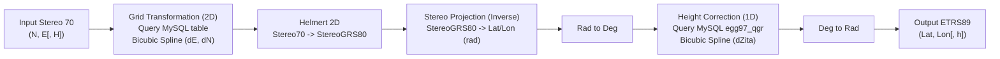

# Legacy Java TransDatOnline Architecture & Implementation Analysis

## 1. Executive Summary

`transdatonline` is the original web application and service implementation of TransDatRO, developed over 10 years ago using Java (Servlets, Apache Tomcat), Google Web Toolkit (GWT), and a MySQL backend. It powered coordinate transformations between Romania's national projected coordinate system (**Stereo 70** / **Stereo 30**) and the European Terrestrial Reference System 1989 (**ETRS89**).

This document analyzes the legacy Java server codebase located in [`transdatonline/server/`](file:///d:/ProiecteRealizate/pyTransDatRO/repo/PyTransDatRO/transdatonline/server) to understand how the REST service, cartographic math, and data serialization operated.

---

## 2. Directory & Component Breakdown

```text
transdatonline/
├── TransDatOnline.gwt.xml              # GWT module definition
├── client/                             # GWT frontend client classes (GWT RPC UI)
│   ├── CoordinateOperationService.java # RPC interface definition
│   ├── CooData.java                    # GWT data transfer object for coordinates
│   └── ui/MainForm.java                # GWT web form UI
├── shared/                             # Shared client/server code
│   ├── Angle.java                      # Angle conversions (Rad, Deg, Grad, DMS parsing)
│   ├── AngleUnits.java                 # Enum for angle formats
│   ├── CoordinateOrder.java            # Enum for NE vs EN coordinate order
│   └── Transformations.java            # Enum: STEREO70_TO_ETRS89, ETRS89_TO_STEREO70, etc.
└── server/                             # Server-side business logic and servlets
    ├── JSONCooOpService.java           # Public REST/HTTP Servlet (GET/POST)
    ├── CoordinateOperationServiceImpl.java # GWT-RPC Servlet for the web UI
    ├── TransDatTransformation.java     # Pipeline coordinator for transformations
    ├── cartography/                    # Geodetic calculations & projections
    │   ├── Ellipsoid.java              # Ellipsoid parameters (Krasovsky40, WGS84, GRS80)
    │   └── cooOperations/
    │       ├── AngleCooOp.java         # Angle conversions (Deg <-> Rad arrays)
    │       ├── projections/
    │       │   ├── Projection.java
    │       │   ├── StereographicOblique.java # Oblique Stereographic projection
    │       │   └── ConformalSphere.java
    │       └── transformations/
    │           ├── Transformation.java
    │           ├── Helmert2D.java      # 4-parameter 2D Helmert transformation
    │           ├── GridTransformation.java # Bicubic spline interpolation over grid nodes
    │           ├── DBgrid.java         # MySQL grid database adapter
    │           └── Grid.java           # Abstract grid node & neighbor indexer
    ├── coo/                            # Coordinate representation and JSON serialization
    │   ├── Coo.java                    # Coordinate entity (supports arbitrary dimensions & problems)
    │   ├── CooGroup.java               # Grouping wrapper
    │   ├── CooJSON.java                # org.json serializer and deserializer
    │   ├── CooProblem.java             # Error/Warning encapsulation
    │   └── CooProblemMessage.java      # Standard problem messages
    ├── db_transdat/
    │   └── DBtransDatGrid.java         # MySQL queries and statistics tracker
    └── model/
        └── BicubicSplineInterpolation.java # Bicubic spline evaluation algorithm
```

---

## 3. The REST Service Architecture: `JSONCooOpService.java`

The public REST/HTTP service is implemented as a standard `HttpServlet` extending `javax.servlet.http.HttpServlet`.

### Key Responsibilities:
1. **Request Interception**:
   - Handles `doGet` (single coordinate sets via URL query parameters) and `doPost` (batch coordinate sets via form body).
   - Parameters:
     - `cooOp`: The operation name (e.g. `Stereo70ToETRS89`, `ETRS89ToStereo70`, `Stereo30ToETRS89`, `ETRS89ToStereo30`).
     - `coos` (for GET): Semicolon-delimited coordinates string (e.g. `500000;500000;100`).
     - `coosArray` (for POST): JSON array string (e.g. `[{"coos":[500000, 500000, 100]}]`).
2. **Error and Validation Flow**:
   - If `cooOp` or `coos` / `coosArray` is null, throws an `IOException`: `"Invalid request! cooOp or coos variable is missing!"`.
   - If `cooOp` is unrecognized, throws an `IOException`: `"There is no defined transformation with name " + cooOp`.
   - Coordinate parsing exceptions (`NumberFormatException`) are intercepted inside `Coo.java` and mapped to `CooProblemMessage.CooDataProblemMessage.INVALID_COORDINATE_DATA`.
3. **Execution & Telemetry**:
   - Invokes `TransDatTransformation` static methods.
   - Updates MySQL statistics via `DBtransDatGrid.updateCooOpAppStatistics(1, type, count)`.
   - Serializes output using `CooJSON.cooToJson()` or `CooJSON.coosToJSONarray()`.

---

## 4. Coordinate Modeling and Serialization (`Coo`, `CooJSON`, `CooProblem`)

### A. Coordinate Representation (`Coo.java`)
- `Coo` represents an $N$-dimensional coordinate point (`ArrayList<Double> coo`).
- Supports a `CooProblem` reference. If a point encounters an issue during processing, `coo.setProblem(...)` is called.
- When `Coo` encounters a parsing error during construction from strings (e.g. non-numeric input `a;b;c`):
  ```java
  private CooProblem createCooProblem(CooDataProblemMessage message) {
      coo.clear(); // Clears coordinates array so coos becomes []
      return new CooProblem(this.toString(), message);
  }
  ```

### B. Serialization Rules (`CooJSON.java`)
The JSON structure emitted by the service follows strict conventions:
```json
{
  "coos": [0.8028465450500996, 0.43630521911977493, 139.7825537763764]
}
```
If a problem occurred, the `warning` field is added to the object:
```json
{
  "coos": [5.0, 1.0, 1.0],
  "warning": "Out of grid"
}
```
If coordinate data was unparseable:
```json
{
  "coos": [],
  "warning": "Invalid coordinate data"
}
```

### C. Standard Problem Messages (`CooProblemMessage.java`)
The legacy system defines four exact warning/problem strings:
| Category | Constant | Warning Message String |
| :--- | :--- | :--- |
| Grid Bounds | `OUT_OF_GRID` | `"Out of grid"` |
| Grid Data | `NO_DATA_ON_GRID` | `"No data on grid"` |
| Input Parsing | `INVALID_COORDINATE_DATA` | `"Invalid coordinate data"` |
| Coordinate Dimension | `WRONG_DIMENSION` | `"Wrong dimension"` |

---

## 5. Mathematical Pipeline Comparison

### Legacy Java Transformation Flow (`Stereo70ToETRS89`)


### Key Differences Between Legacy Java and Modern `pytransdatro`

| Aspect | Legacy Java (`transdatonline`) | Modern Python (`pytransdatro`) | Operational Impact |
| :--- | :--- | :--- | :--- |
| **Grid Storage** | MySQL database tables (`etrs89_krasovschi42_2d`, `egg97_qgr`) queried over JDBC | Single binary `.spg` package auto-discovered by `SpgReader` in RAM | Modern version is $\approx 100\times$ faster, self-contained, zero database latency |
| **Planimetric 2D Model** | Older TransDatRO Krasovsky42 distortion grid | Modern SPG planar distortion shifts (`geodetic_shifts`) | 2D coordinates agree to within **$< 10^{-15}\text{ radians}$** / **$< 0.001\text{ mm}$** |
| **Elevation 1D Model** | Older EGG97 quasigeoid model (`dZita`) interpolated via bicubic spline | Modern Romanian quasigeoid grid (`geoid_heights`) via nearest-neighbor colocate lookup | Differences in elevation $h / H$ of up to **$\approx 0.17 - 1.0\text{ m}$** due to the updated geoid model |
| **Supported Projections** | Stereo 70 and legacy Stereo 30 | Stereo 70 | Stereo 30 is obsolete; legacy requests can be handled with explicit messages |
| **Telemetry & Stats** | Synchronous MySQL `statistics` table updates | Asynchronous SQLite WAL daemon (`SqliteUsageLogger`) with ~1km spatial binning | Non-blocking, privacy-preserving, zero disk overhead on worker threads |

---

## 6. Takeaways for the REST Service Redesign

1. **Exact Contract Compatibility**: The legacy endpoint `/transdatonline/cooOpService` must be faithfully reproduced in the new FastAPI service.
2. **Behavioral Fidelity**:
   - `cooOp` and `coos` parameters must be accepted via `GET`.
   - `cooOp` and `coosArray` parameters must be accepted via `POST` (both `form-data` and JSON body).
   - Coordinate outputs must remain in radians for ETRS89 and meters for Stereo 70.
   - Exact warnings (`"Out of grid"`, `"No data on grid"`, `"Invalid coordinate data"`) must match byte-for-byte.
3. **Seamless Modernization**: While the external contract remains completely unchanged for existing consumers, the internal engine will use `pytransdatro.TransRO` with sub-millisecond execution and modern SQLite telemetry.
