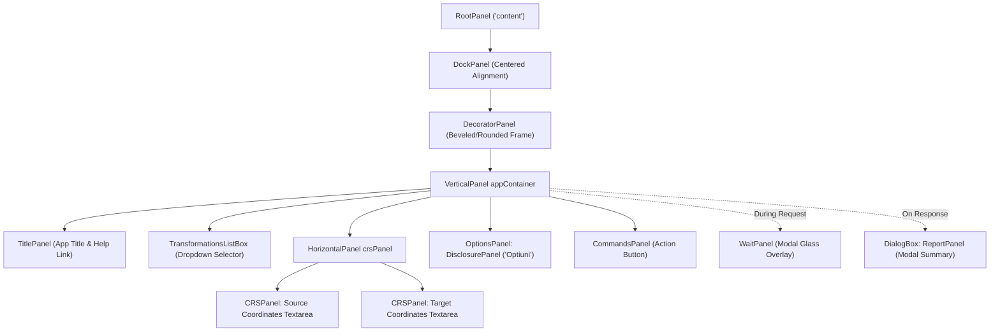

# Legacy TransDatOnline Web UI Specification & Visual Design

## 1. Executive Summary & Overview

**TransLT Online România V1.0** (historically deployed at [https://www.geo-spatial.org/transdatonline/](https://www.geo-spatial.org/transdatonline/)) was the original web application developed in 2012 by [geo-spatial.org](https://www.geo-spatial.org) for geodetic coordinate transformations across Romania. 

Built using **Google Web Toolkit (GWT 2.x)**, the entire user interface and client logic was written in Java and compiled into browser-executable JavaScript (`transdatonline.nocache.js`).

This document provides a comprehensive specification of:
1. The visual appearance and layout of the legacy user interface.
2. The user interface component hierarchy and DOM mounting structure.
3. All interactive user options, controls, and widgets.
4. CSS styling, color schemes, typography, and visual feedback cues.
5. The transformation workflow and user experience lifecycle.

---

## 2. Visual Layout & Component Hierarchy

The web application is embedded into the host page within a centered `<div>`:
```html
<div align="center" id="content"></div>
```

The application UI is structured using nested GWT layout panels centered both horizontally and vertically.

### 2.1. Structural Component Tree



### 2.2. Visual Wireframe Layout

```text
+---------------------------------------------------------------------------------------+
|  [TitlePanel]                                                                         |
|  TransLT Online Romania V1.0                                                  Ajutor  |
+---------------------------------------------------------------------------------------+
|  [TransformationsListBox]                                                             |
|  Selectati transformarea: [ Stereo70-->ETRS89                                    [v] ]|
+---------------------------------------------------------------------------------------+
|  [HorizontalPanel crsPanel]                                                           |
|  +-------------------------------------+   +-------------------------------------+    |
|  | [sourceCRS Textarea]                |   | [targetCRS Textarea]                |    |
|  | Width: 280px, Height: 448px         |   | Width: 280px, Height: 448px         |    |
|  | Wrap: off                           |   | Wrap: off                           |    |
|  |                                     |   |                                     |    |
|  | 500000;500000;100                   |   | 45°59'58.987";24°59'54.411";139.608 |    |
|  | 500100;500100;105                   |   | 46°00'02.213";24°59'58.892";144.598 |    |
|  |                                     |   |                                     |    |
|  +-------------------------------------+   +-------------------------------------+    |
+---------------------------------------------------------------------------------------+
|  [OptionsPanel (DisclosurePanel)]                                                     |
|  [v] Optiuni                                                                          |
|      Ordinea coordonatelor:    (o) NE(H) | LatLong(h)    ( ) EN(H) | LongLat(h)       |
|      Unghiuri exprimate in:    (o) Grade, minute, secunde  ( ) Grade  ( ) Radiani     |
|      Separator(i) coordonate:  [ ] Tab  [ ] Spatiu  [ ] Virgula  [ ] Punct si virgula |
+---------------------------------------------------------------------------------------+
|  [CommandsPanel]                                                                      |
|  -----------------------------------------------------------------------------------  |
|                                                          [ Aplica transformarea ]     |
+---------------------------------------------------------------------------------------+
```

---

## 3. Detailed UI Component Breakdown

### 3.1. Header & Title Bar ([`TitlePanel.java`](file:///d:/ProiecteRealizate/pyTransDatRO/repo/PyTransDatRO/transdatonline/client/ui/TitlePanel.java))
* **Application Title**: A centered bold label reading `"TransLT Online Romania V1.0"`.
* **Help Link**: An anchor element positioned on the far right (`DockPanel.EAST`):
  * Label: `"Ajutor"`
  * Destination: Hyperlink to [`HelpTransdatOnline.html`](file:///d:/ProiecteRealizate/pyTransDatRO/repo/PyTransDatRO/transdatonline/HelpTransdatOnline.html)
  * Styling: Subtle link color (`graytext`), hovering displays bold weight.
* **Bar Styling**: Background gradient (`#ebebeb url(images/hborder.png) repeat-x`), bottom border `1px solid #bbbbbb`, margin bottom `10px`.

### 3.2. Transformation Selector ([`TransformationsListBox.java`](file:///d:/ProiecteRealizate/pyTransDatRO/repo/PyTransDatRO/transdatonline/client/ui/TransformationsListBox.java))
* **Label**: `"Selectati transformarea: "` with bold styling (`OptionLabel`).
* **Dropdown (`ListBox`)**: Single-selection dropdown list containing the 4 transformation pipelines defined in [`Transformations.java`](file:///d:/ProiecteRealizate/pyTransDatRO/repo/PyTransDatRO/transdatonline/shared/Transformations.java):
  1. `Stereo70-->ETRS89` *(Default selection at index 0)*
  2. `Stereo30-->ETRS89`
  3. `ETRS89-->Stereo70`
  4. `ETRS89-->Stereo30`
* **Layout**: Horizontal panel with centered vertical alignment.

### 3.3. Dual Coordinate Workspaces ([`CRSPanel.java`](file:///d:/ProiecteRealizate/pyTransDatRO/repo/PyTransDatRO/transdatonline/client/ui/CRSPanel.java))
* **Source CRS Panel (`sourceCRS`)**:
  * Multiline text input (`TextArea`) where the user pastes or enters coordinates.
  * Dimensions: Fixed width `280px`, fixed height `448px`.
  * Text Wrapping: Explicitly disabled via `wrap="off"` attribute to preserve tabular alignment of coordinates.
  * Style Class: `.CooTextArea` (`font-size: 12px; letter-spacing: -1px; margin: 5px 10px;`).
* **Target CRS Panel (`targetCRS`)**:
  * Multiline text display (`TextArea`) where transformed coordinates and row-level warning messages are populated.
  * Identical geometry (`280px` $\times$ `448px`, `wrap="off"`).
  * Read/Write: Though meant for output, it remains an editable textarea allowing users to select and copy text.
* **Arrangement**: Side-by-side inside a `HorizontalPanel` with margin spacing.

### 3.4. Collapsible Options Section ([`OptionsPanel.java`](file:///d:/ProiecteRealizate/pyTransDatRO/repo/PyTransDatRO/transdatonline/client/ui/OptionsPanel.java))
Encapsulated inside a GWT `DisclosurePanel` labeled **"Optiuni"** with expand/collapse animations. Contains a 3-row, 2-column table grid (`Grid(3, 2)`):

#### Row 0: Coordinate Order (`CoordinateOrderPanel`)
* **Label**: `"Ordinea coordonatelor: "`
* **Options (Radio Buttons)**:
  * `NE(H) | LatLong(h)`: Northing first, Easting second (or Latitude first, Longitude second). Selected by default.
  * `EN(H) | LongLat(h)`: Easting first, Northing second (or Longitude first, Latitude second). Standard for CAD/GIS software.

#### Row 1: Angular Units (`AngleUnitRadioButtonPanel`)
* **Label**: `"Unghiuri exprimate in: "`
* **Options (Radio Buttons)**:
  * `Grade, minute, secunde`: Degrees, Minutes, Seconds (DMS format, e.g. `45°59'58.99"`). Selected by default.
  * `Grade`: Decimal degrees (e.g. `45.9997186280`).
  * `Radiani`: Geodetic radians (e.g. `0.8028465450501`).

#### Row 2: Coordinate Delimiters (`DelimiterCheckBoxPanel`)
* **Label**: `"Separator(i) coordonate: "`
* **Options (Checkboxes)**:
  * `[ ] Tab`: Delimited by tabs (`\t+`).
  * `[ ] Spatiu`: Delimited by spaces (`\s+`).
  * `[ ] Virgula`: Delimited by commas (`,+`).
  * `[ ] Punct si virgula`: Delimited by semicolons (`;+`).
* **Default State**: All checkboxes are unchecked upon initial load. When no checkboxes are selected, the app implicitly defaults to semicolon (`;+`) for input parsing and semicolon (`;`) for output formatting.

### 3.5. Action Command Bar ([`CommandsPanel.java`](file:///d:/ProiecteRealizate/pyTransDatRO/repo/PyTransDatRO/transdatonline/client/ui/CommandsPanel.java))
* **Separation Line**: Top border `1px solid #CDCDCD`.
* **Primary Action Button**:
  * Text: `"Aplica transformarea"` ("Apply transformation").
  * Alignment: Right-aligned (`DockPanel.EAST`, `HasAlignment.ALIGN_RIGHT`).
  * Triggers the full client-side parsing, server RPC call, and UI update cycle.

---

## 4. Modal Overlays & Interactive Dialogs

### 4.1. Wait Progress Panel ([`WaitPanel.java`](file:///d:/ProiecteRealizate/pyTransDatRO/repo/PyTransDatRO/transdatonline/client/ui/WaitPanel.java))
* **Type**: `PopupPanel` with modal glass enabled (`setGlassEnabled(true)`), blocking all background user interactions during calculation.
* **Position**: Dynamically centered over the main form:
  $$\text{left} = \text{MainForm.left} + \frac{\text{width}}{2} - 75\text{px}, \quad \text{top} = \text{MainForm.top} + \frac{\text{height}}{2} - 5\text{px}$$
* **Content**: Single text label: `"Transformare coordonate..."` ("Transforming coordinates...").

### 4.2. Transformation Summary Report Modal ([`ReportPanel.java`](file:///d:/ProiecteRealizate/pyTransDatRO/repo/PyTransDatRO/transdatonline/client/ui/ReportPanel.java))
* **Type**: `DialogBox` with glass overlay (`setGlassEnabled(true)`) and drop-in animation (`setAnimationEnabled(true)`).
* **Title**: `"Raport transformare coordonate"` ("Coordinate Transformation Report").
* **Position**: Centered over the application window.
* **Sections**:
  1. **Date intrare (Input Data)**:
     * *Numar total coordonate*: Total number of detected input lines.
     * *Numar coordonate invalide*: Malformed, unparseable, or out-of-dimension lines.
  2. **Date iesire (Output Data)**:
     * *Numar total coordonate*: Total output points processed.
     * *Numar coordonate invalide*: Count of invalid points echoed.
     * *Numar coordonate in afara gridului*: Points falling outside the `.spg` bounding box.
     * *Numar coordonate fara valori in grid*: Points inside the bounding box but in nodata grid cells.
* **Dismiss Action**: Bottom-right button labeled `"Inchide"` ("Close") which hides the dialog.

---

## 5. CSS Stylesheet & Typography Specification

The styling is defined in `css/TransDatOnline.css` combined with the GWT Chrome theme (`com.google.gwt.user.theme.chrome.Chrome`):

| CSS Selector / Class | Applied To | Visual Properties |
| :--- | :--- | :--- |
| `#content` | Page Wrapper | `margin: 40px;` centered alignment |
| `.TitleBar` | App Header Bar | Background `#ebebeb`, bottom border `1px solid #bbbbbb`, bold weight, `padding: 4px 4px 4px 8px; margin-bottom: 10px;` |
| `.TitleBar a` | Help Anchor Link | Color: `graytext`, text-decoration: `none`. Hover: bold weight |
| `.OptionLabel` | Form & Section Labels | `font-weight: bold; text-align: left; margin: 4px 4px 4px 8px;` |
| `.CooTextArea` | Input/Output Textareas | `font-size: 12px; letter-spacing: -1px; margin: 5px 10px;` |
| `.ContentPanel` | General Containers | `padding: 5px;` |
| `.CommandsPanel` | Footer Action Bar | Top border `1px solid #CDCDCD`, `padding: 5px 0 5px 5px; width: 98%;` |
| `.Report` | Modal Summary | `padding: 5px;` |
| `.Report .Category`| Report Section Title | Bottom border `1px solid #CDCDCD`, `margin-top: 5px; padding-bottom: 5px; font-weight: bold;` |
| `.SuccesText` | Status Count = 0 | Color: `green` (`#008000`) |
| `.WarningText` | Minor Grid Warning | Color: `orange` (`#FFA500`) |
| `.ErrorText` | Invalid Data / Out of Grid | Color: `red` (`#FF0000`) |

---

## 6. Help File Structure ([`HelpTransdatOnline.html`](file:///d:/ProiecteRealizate/pyTransDatRO/repo/PyTransDatRO/transdatonline/HelpTransdatOnline.html))

The application links to a static Romanian-language help page featuring:
1. **General Description**: Defines supported transformations (ETRS89 $\leftrightarrow$ Stereo 70, ETRS89 $\leftrightarrow$ Stereo 30 with elevations in the Black Sea 1975 datum).
2. **Interface Instructions**: Explains transformation selection, coordinate order (`NE` vs `EN`), angle units, and delimiters.
3. **Report Diagnostics**: Explains the report metrics and the three-tier color coding:
   * **Verde (Green)**: Fără probleme (No issues).
   * **Portocaliu (Orange)**: Probleme minore (Minor issues: points inside grid bounds but lacking distortion data).
   * **Roșu (Red)**: Probleme majore (Major issues: unparseable syntax or completely outside the grid).
