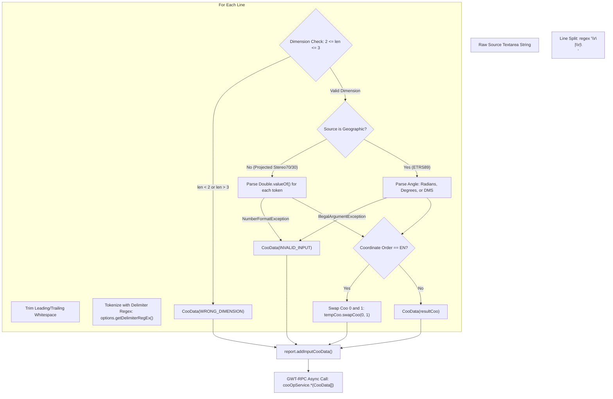
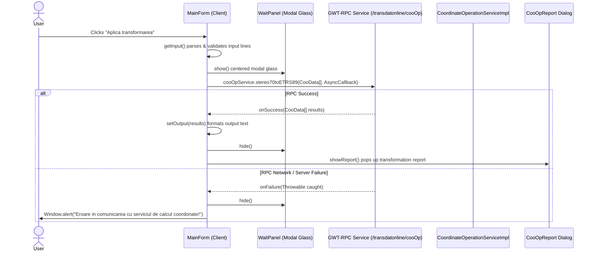

# Legacy TransDatOnline Client-Side Logic, Parsing & Validation

## 1. Executive Summary & Overview

In the legacy **TransDatOnline** GWT application, substantial business logic, coordinate parsing, angle conversions, formatting, and validation occur directly on the **client side** (in compiled JavaScript inside the user's browser) before and after dispatching an asynchronous RPC request to the Java backend.

This document details:
1. The client-side text parsing and delimiter tokenization pipeline.
2. Angular unit handling and the custom DMS (Degrees-Minutes-Seconds) parser.
3. Coordinate dimension checking and coordinate order swapping (`NE` vs `EN`).
4. Communication with the backend via GWT-RPC and asynchronous callback lifecycles.
5. Error propagation, warning messages, and the quantitative transformation reporting mechanism ([`CooOpReport`](file:///d:/ProiecteRealizate/pyTransDatRO/repo/PyTransDatRO/transdatonline/client/CooOpReport.java)).

---

## 2. Text Parsing & Tokenization Pipeline

When the user clicks the **"Aplica transformarea"** button, [`MainForm.convert()`](file:///d:/ProiecteRealizate/pyTransDatRO/repo/PyTransDatRO/transdatonline/client/ui/MainForm.java#L74-L128) extracts the raw string from the source textarea and passes it through an in-browser parsing pipeline:



### 2.1. Line Splitting
* Input text is split into lines using the regular expression:
  ```java
  String[] values = delString.split("\r\n|\r|\n");
  ```
  Empty input (`""`) returns `null` immediately without making a network request.

### 2.2. Delimiter Regex Tokenization
* Individual lines are trimmed and split using a regex generated by [`DelimiterCheckBoxPanel.getDelimiterRegEx()`](file:///d:/ProiecteRealizate/pyTransDatRO/repo/PyTransDatRO/transdatonline/client/ui/DelimiterCheckBoxPanel.java#L19-L33):
  * **Checkbox combinations**:
    * Tab: `\t+`
    * Space: ` +` (one or more spaces)
    * Comma: `,+`
    * Semicolon: `;+`
  * If multiple checkboxes are checked (e.g. Tab and Space), they are concatenated with pipe (`|`): `\t+| +`.
  * **Default Fallback**: If no checkboxes are checked, it defaults strictly to semicolon: `";+"`.
  * The `+` quantifier in each pattern ensures that consecutive whitespace or delimiters are collapsed into a single boundary.

### 2.3. Dimension Validation
* The token count must strictly satisfy $2 \le \text{dimension} \le 3$:
  * **2D**: $(N, E)$ or $(\text{Lat}, \text{Lon})$
  * **3D**: $(N, E, H)$ or $(\text{Lat}, \text{Lon}, h)$
* If the line has fewer than 2 tokens or more than 3 tokens:
  ```java
  if ((dimension < 2) || (dimension > 3)) {
      throw new IndexOutOfBoundsException();
  }
  ```
  This is trapped and wrapped as a `CooData` object with problem code `CooDataProblems.WRONG_DIMENSION`.

---

## 3. Coordinate Parsing & Conversion Algorithms

### 3.1. Projected Coordinate Parsing (Stereo 70 / Stereo 30 $\rightarrow$ ETRS89)
When source coordinates are projected, all tokens (Northing, Easting, and optional Elevation) are parsed as pure floating-point numbers:
```java
for (int i = 0; i < dimension; i++) {
    resultCoo[i] = Double.valueOf(input[i]);
}
```
Any parse failure produces `CooDataProblems.INVALID_INPUT`.

### 3.2. Geographic Coordinate Parsing (ETRS89 $\rightarrow$ Stereo 70 / Stereo 30)
When source coordinates are geographic, coordinate parsing behavior depends on the user's selected unit ([`AngleUnits`](file:///d:/ProiecteRealizate/pyTransDatRO/repo/PyTransDatRO/transdatonline/shared/AngleUnits.java)):

#### A. Radians (`AngleUnits.RADIANS`)
* Parsed as decimal doubles directly:
  $$\text{coordinate}_{\text{rad}} = \text{Double.valueOf}(\text{token})$$

#### B. Decimal Degrees (`AngleUnits.DEGREES`)
* Parsed as decimal doubles and converted to radians client-side via:
  $$\text{coordinate}_{\text{rad}} = \text{Double.valueOf}(\text{token}) \times \frac{\pi}{180}$$

#### C. Degrees, Minutes, Seconds (`AngleUnits.DMS`)
* Parsed via the custom parser [`Angle.valueOfDMS(String dms)`](file:///d:/ProiecteRealizate/pyTransDatRO/repo/PyTransDatRO/transdatonline/shared/Angle.java#L29-L70):
  1. Detects sign: if `dms.charAt(0) == '-'`, $\text{sign} = -1$, else $+1$.
  2. Splits token using symbol delimiters:
     ```java
     String[] sDMS = dms.split(String.valueOf((char) 176) + "|d|m|s|'|''|\"|\\s+");
     ```
     This matches the degree symbol `°` (char 176), `d`, `m`, `s`, single quote `'`, double quotes `''` or `"`, and whitespace.
  3. Extracts components:
     * $d = |\text{Double.valueOf}(sDMS[0])|$
     * $m = \text{Double.valueOf}(sDMS[1])$ (or $0.0$ if absent)
     * $s = \text{Double.valueOf}(sDMS[2])$ (or $0.0$ if absent)
  4. Range checks:
     * Throws `IllegalArgumentException` if $m < 0$ or $m \ge 60$.
     * Throws `IllegalArgumentException` if $s < 0$ or $s \ge 60$.
  5. Computes radians:
     $$\text{rad} = \text{sign} \times \frac{\pi}{180} \times \left(d + \frac{m}{60} + \frac{s}{3600}\right)$$

* For 3D points, the 3rd token (elevation/height) is always parsed as a decimal double without angular conversion.

---

## 4. Coordinate Axis Ordering & Swapping Mechanism

The application explicitly supports Romanian cadastral convention vs. general GIS/CAD conventions:

| Mode | Coordinate 0 | Coordinate 1 | Coordinate 2 |
| :--- | :--- | :--- | :--- |
| **`NE` (Default)** | Northing ($N$ / $X$) or Latitude ($\phi$) | Easting ($E$ / $Y$) or Longitude ($\lambda$) | Elevation ($H$ / $h$) |
| **`EN`** | Easting ($E$ / $Y$) or Longitude ($\lambda$) | Northing ($N$ / $X$) or Latitude ($\phi$) | Elevation ($H$ / $h$) |

### Swapping Flow:
1. **Input**: If the user selected `EN`, the client immediately swaps indices 0 and 1 before creating the payload:
   ```java
   if (swapCoo) {
       CooData tempCoo = new CooData(resultCoo);
       tempCoo.swapCoo(0, 1);
       return tempCoo;
   }
   ```
   *Result*: The backend server *always* receives $(N, E)$ or $(\text{Lat}, \text{Lon})$ regardless of user input order.
2. **Output**: When formatting the results for display, if `EN` was selected, the client re-swaps indices 0 and 1 so the output matches the user's selected preference.

---

## 5. Output Formatting & Precision Rules

Once the server returns transformed coordinates, the client formats each point into a line of text via [`MainForm.cooDataToOutputString()`](file:///d:/ProiecteRealizate/pyTransDatRO/repo/PyTransDatRO/transdatonline/client/ui/MainForm.java#L234-L288):

### 5.1. Error Lines
If a point has an error (`coo.hasProblem()`), the numerical values are omitted and the localized error message is printed directly on that row:
* `"Coordonate invalide"` (for unparseable or wrong-dimension inputs)
* `"Coordonate in afara gridului"` (for out-of-grid points)
* `"Gridul nu contine date"` (for points in nodata cells)

### 5.2. Projected Outputs (Stereo 70 / Stereo 30)
* All dimensions ($X, Y, Z$) are formatted using GWT `NumberFormat`:
  $$\text{pattern} = \text{"0.000"} \quad (3\text{ decimal digits, millimeter precision})$$
* Delimited using the output delimiter.
* **Legacy Quirk**: [`DelimiterCheckBoxPanel.getDelimiter()`](file:///d:/ProiecteRealizate/pyTransDatRO/repo/PyTransDatRO/transdatonline/client/ui/DelimiterCheckBoxPanel.java#L35-L43) was hardcoded to return `";"` (`Delimiters.SEMICOLON.chars`), ignoring the checkbox selections for output.

### 5.3. Geographic Outputs (ETRS89)
* **Radians**: Formatted with 16 decimal places (`0.0000000000000000`).
* **Decimal Degrees**: Formatted with 11 decimal places (`0.00000000000`).
* **DMS**: Formatted using [`Angle.toDMSString()`](file:///d:/ProiecteRealizate/pyTransDatRO/repo/PyTransDatRO/transdatonline/shared/Angle.java#L80-L110):
  * Pattern: `DD°MM'SS.sss"`
  * Degrees and minutes are zero-padded to 2 digits (`00`).
  * Seconds are formatted to 5 significant decimal figures with zero-padding (`00.00000`).
  * Rollover logic: If seconds round to $\ge 60$, seconds reset to $0.0$ and minutes increment; if minutes reach $\ge 60$, minutes reset to $0$ and degrees increment.
* Elevation (if 3D): Formatted to 3 decimal places (`0.000`).

---

## 6. Client-Server Communication & Asynchronous Lifecycle

The application communicates with the backend via **GWT-RPC**:



### 6.1. UI Blocking
* During calculation, [`WaitPanel`](file:///d:/ProiecteRealizate/pyTransDatRO/repo/PyTransDatRO/transdatonline/client/ui/WaitPanel.java) disables and dims the screen with a glass pane (`setGlassEnabled(true)`), preventing duplicate submissions or race conditions.

### 6.2. Network Error Handling
* If the server times out, returns HTTP 500, or drops the connection, `onFailure` dismisses the wait panel and presents a native browser alert:
  ```text
  "Eroare in comunicarea cu serviciul de calcul coordonate!"
  ```

---

## 7. The Transformation Reporting System ([`CooOpReport.java`](file:///d:/ProiecteRealizate/pyTransDatRO/repo/PyTransDatRO/transdatonline/client/CooOpReport.java))

The application maintains real-time bookkeeping of coordinate health across the lifecycle of a batch transformation:

### 7.1. Counters & State Transitions

| State / Metric | When Recorded | Classification in Report | Visual Cue |
| :--- | :--- | :--- | :--- |
| `inputTotalCoo` | On parsing input lines | Total Input Lines | Neutral text |
| `inputInvalidCoo` | `INVALID_INPUT` or `WRONG_DIMENSION` | Malformed/unparseable input | Green if $0$, **Red** if $> 0$ |
| `outputTotalCoo` | On receiving server response | Total Output Points | Neutral text |
| `outputInvalidCoo` | Echoed `INVALID_INPUT` / `WRONG_DIMENSION` | Invalid points passed through | Green if $0$, **Red** if $> 0$ |
| `outputOutsideGridCoo` | `OUT_OF_GRID` returned by server | Coordinates outside `.spg` bounding box | Green if $0$, **Red** if $> 0$ |
| `outputOutsideBoundaryCoo`| `NO_GRID_DATA` returned by server | Coordinates in nodata cells | Green if $0$, **Orange** if $> 0$ |

### 7.2. Three-Tier Visual Diagnostic System
As described in [`HelpTransdatOnline.html`](file:///d:/ProiecteRealizate/pyTransDatRO/repo/PyTransDatRO/transdatonline/HelpTransdatOnline.html) and implemented in [`ReportPanel.java`](file:///d:/ProiecteRealizate/pyTransDatRO/repo/PyTransDatRO/transdatonline/client/ui/ReportPanel.java):
* **Fără probleme (Success - Green)**: Value equals 0. All coordinates successfully converted.
* **Probleme minore (Warning - Orange)**: `outputOutsideBoundaryCoo > 0`. Points are technically within the geographic bounds of the grid, but lack interpolation distortion shifts.
* **Probleme majore (Error - Red)**: `inputInvalidCoo > 0` or `outputOutsideGridCoo > 0`. Severe coordinate syntax error or coordinates completely outside Romania's national grid envelope.
