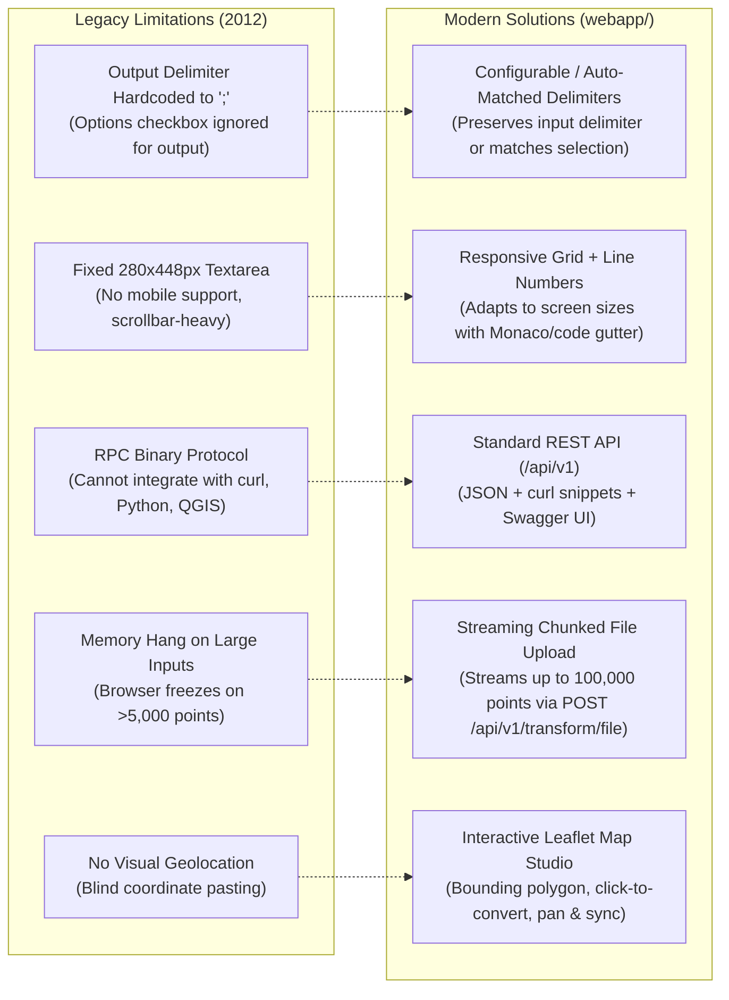

# TransDat Legacy-to-Modern Web App Transition & Gap Analysis

## 1. Executive Summary

This document provides a comparative architectural and functional bridge between the **Legacy 2012 GWT Web App** ([`transdatonline/`](file:///d:/ProiecteRealizate/pyTransDatRO/repo/PyTransDatRO/transdatonline)) and the **Modern PyTransDatRO Web Application** specified in [`specs/web_app.md`](file:///d:/ProiecteRealizate/pyTransDatRO/repo/PyTransDatRO/specs/web_app.md) and powered by the REST API documented in [`docs/rest_api.md`](file:///d:/ProiecteRealizate/pyTransDatRO/repo/PyTransDatRO/docs/rest_api.md).

It identifies architectural gaps, highlights legacy strengths that must be preserved (e.g. DMS parsing, Romanian `NE` coordinate ordering, diagnostic reporting), rectifies legacy limitations, and provides concrete directives for implementing the modern frontend in `webapp/`.

---

## 2. Comprehensive Architectural Comparison

| Architectural Aspect | Legacy TransDatOnline (2012) | Modern PyTransDatRO Web App (Current) | Rationale & Evolution |
| :--- | :--- | :--- | :--- |
| **Frontend Framework** | Google Web Toolkit (GWT 2.x, Java $\rightarrow$ JS) | Vite + Vanilla TypeScript + Vanilla CSS | Modern, lightweight, standard web tech, zero bloat, instant HMR |
| **Client/Server Protocol**| GWT-RPC (`/transdatonline/cooOp`) binary format | Standard HTTP/REST JSON & Multipart Streaming | Open, inspectable, interoperable with external GIS tools and browser `fetch()` |
| **Backend Engine** | Apache Tomcat + Java Servlets + MySQL | FastAPI + Pure Python Standard Library (`pytransdatro`) | Ultra-fast in-memory bicubic spline execution ($<0.05\text{ ms/pt}$), no database query bottleneck |
| **Spatial Visualization**| None (pure textareas) | Interactive Leaflet.js Map Studio | Allows visual verification, click-to-convert, and Romania grid polygon overlay |
| **Responsive Design** | Fixed desktop layout ($280\text{px} \times 448\text{px}$ textareas) | Fully mobile-responsive CSS Grid & Flexbox | Accessible from field surveyor smartphones, tablets, and wide monitors |
| **Single Point Conversion**| Shared through textarea batch interface | Dedicated "Interactive Point Studio" with instant feedback | Instant single-point lookup without needing to configure batch settings |
| **Bulk File Ingestion** | None (manual copy-paste into textarea only) | Drag-and-drop CSV/TXT with streaming chunked response | Handles real-world survey files up to 100,000 points without browser memory crashes |
| **Coordinate Ordering** | Supported `NE` (default) and `EN` | Preserved and expanded `NE` vs `EN` support | Maintains compliance with Romanian cadastral standard ($X = \text{North}, Y = \text{East}$) |
| **Angular Formats** | Degrees, DMS (`DD°MM'SS.sss"`), Radians | Degrees, DMS, Radians + live bidirectional unit toggle | Retains survey-grade topographic report compatibility |
| **Obsolete CRS Handling**| Included legacy Stereo 30 | Stereo 30 deprecated; Stereo 70 $\leftrightarrow$ ETRS89 core focus | Avoids user errors; clear UI banners if obsolete data is detected |
| **Public Telemetry** | MySQL point counter table | SQLite asynchronous logger + Public Transparency Dashboard | Public accountability without performance penalty |

---

## 3. Preserved Features & Algorithmic Porting

The legacy application got several key domain-specific ergonomics right. The modern web application must preserve and enhance these:

### 3.1. Degrees-Minutes-Seconds (DMS) Parsing
* **Legacy Implementation**: [`Angle.valueOfDMS`](file:///d:/ProiecteRealizate/pyTransDatRO/repo/PyTransDatRO/transdatonline/shared/Angle.java#L29-L70) parsed arbitrary DMS strings such as `45°59'58.99"`, `45d 59m 58.99s`, and `45 59 58.99`.
* **Porting Directive for `webapp/src/utils/dmsParser.ts`**:
  - Implement a TypeScript port of the regex `[°dms'"\s]+` tokenization.
  - Support cardinal hemisphere indicators (`N`, `S`, `E`, `W`).
  - Support bidirectional conversions: $\text{DMS} \leftrightarrow \text{Decimal Degrees} \leftrightarrow \text{Radians}$.

### 3.2. Coordinate Axis Swapping (`NE` vs `EN`)
* **Cadastral Convention**: Romanian surveyors expect Northing ($X$) first, Easting ($Y$) second.
* **GIS / Web Convention**: Web maps and geojson expect Longitude/Easting first, Latitude/Northing second.
* **Porting Directive**:
  - The client must maintain a state toggle: `coordinateOrder: 'NE' | 'EN'`.
  - When calling the REST API, the client normalizes input tuples to the REST API contract: `[Northing, Easting, Elevation]` or `[Latitude, Longitude, Height]`.
  - When presenting results to the user, the client reformats the output according to the user's active choice.

### 3.3. Transformation Diagnostic Report Modal
* **Legacy Implementation**: [`ReportPanel.java`](file:///d:/ProiecteRealizate/pyTransDatRO/repo/PyTransDatRO/transdatonline/client/ui/ReportPanel.java) presented a structured health summary post-conversion.
* **Porting Directive for `webapp/src/components/ReportModal.ts`**:
  - Retain the exact diagnostic categories:
    1. Total points submitted.
    2. Invalid / malformed rows (with clickable row jump).
    3. Points outside the Romanian grid boundary (`Out of grid`).
    4. Points with missing distortion values (`No data on grid`).
  - Preserve the three-tier color coding:
    * **Emerald Green**: All coordinates converted successfully.
    * **Amber Warning**: Minor grid boundary warnings.
    * **Crimson Error**: Unparseable coordinates or points outside Romanian territory.

---

## 4. Rectification of Legacy Limitations & Quirks

During the code audit of [`transdatonline/`](file:///d:/ProiecteRealizate/pyTransDatRO/repo/PyTransDatRO/transdatonline), several limitations and bugs were identified that the modern web app resolves:

### Specific Bug Fixes:
1. **Output Delimiter**: In [`DelimiterCheckBoxPanel.java:L42`](file:///d:/ProiecteRealizate/pyTransDatRO/repo/PyTransDatRO/transdatonline/client/ui/DelimiterCheckBoxPanel.java#L42), `getDelimiter()` was hardcoded to return `;`. In the new web app, the output delimiter mirrors the detected input delimiter or the user's explicit preference.
2. **Missing Point-by-Point URL Sharing**: The legacy app had no URL state. In the new app, `PointConverter.ts` synchronizes with URL query parameters (`?op=Stereo70ToETRS89&n=500000&e=500000`), allowing surveyors to share coordinate bookmarks directly.
3. **Deprecated Datums**: Stereo 30 was based on an obsolete Krasovsky ellipsoid formulation without modern official support. The modern app defaults to Stereo 70 and informs users about Stereo 30 deprecation.

---

## 5. API Mapping for Frontend Integration

The modern web application interfaces with the endpoints documented in [`docs/rest_api.md`](file:///d:/ProiecteRealizate/pyTransDatRO/repo/PyTransDatRO/docs/rest_api.md):

| Web App Feature / Module | Target API Endpoint | HTTP Method | Request / Response Schema |
| :--- | :--- | :--- | :--- |
| **Interactive Point Studio** | `/api/v1/transform/point` | `POST` | `PointTransformRequest` $\rightarrow$ `PointTransformResponse` |
| **Batch Textarea Studio** | `/api/v1/transform/batch` | `POST` | `BatchTransformRequest` (up to 20k pts) $\rightarrow$ `BatchTransformResponse` |
| **Bulk File Studio** | `/api/v1/transform/file` | `POST` | Multipart form (`file`, `op`, `unit`, `delimiter`) $\rightarrow$ Streaming CSV |
| **Map Grid Boundary Layer** | `/api/v1/grid/info` | `GET` | SPG metadata, bounding box coordinates |
| **Transparency Dashboard** | `/api/v1/telemetry/stats` | `GET` | Daily call & point metrics, active grid stats |
| **Backend Health Check** | `/health` | `GET` | Service status, RAM grid load confirmation |

*All web app requests must include the header `X-Client-Source: web_app` to be recorded as `source=1` (`web_map`) in the telemetry database.*

---

## 6. Implementation Readiness Checklist

With the legacy UI and client logic fully documented in:
* [`04_legacy_web_ui_specification.md`](file:///d:/ProiecteRealizate/pyTransDatRO/repo/PyTransDatRO/docs/transdatonline/04_legacy_web_ui_specification.md)
* [`05_legacy_client_functionality_and_validation.md`](file:///d:/ProiecteRealizate/pyTransDatRO/repo/PyTransDatRO/docs/transdatonline/05_legacy_client_functionality_and_validation.md)
* [`06_modern_web_app_transition_analysis.md`](file:///d:/ProiecteRealizate/pyTransDatRO/repo/PyTransDatRO/docs/transdatonline/06_modern_web_app_transition_analysis.md)

The next step is frontend development inside `webapp/` using Vite + TypeScript + Leaflet following the roadmap established in [`specs/web_app.md`](file:///d:/ProiecteRealizate/pyTransDatRO/repo/PyTransDatRO/specs/web_app.md).
