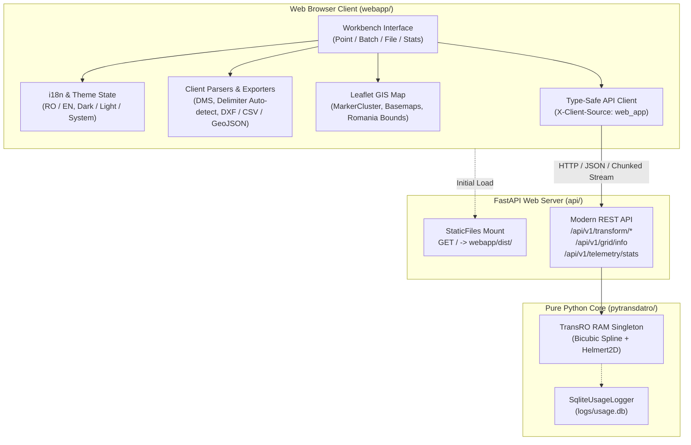

# PyTransDatRO Web Application Architecture & Specification

## 1. Overview & Architecture

The `webapp/` package provides a modern, high-performance Web GIS Single Page Application (SPA) designed to bring Romania's official geodetic coordinate transformation platform (**TransDatRO**) into modern web browsers.

It replaces the 10+ year-old Java/GWT TransDatOnline web interface with a responsive, zero-framework, client-side application built with **Vite**, **TypeScript**, **Vanilla CSS**, and **Leaflet**.



---

## 2. Technology Stack & Key Invariants

1. **Vanilla CSS Design System**:
   - Zero bulky CSS frameworks (no Bootstrap, no Tailwind runtime overhead).
   - Driven entirely by custom CSS design tokens defined in [`webapp/src/style/variables.css`](file:///d:/ProiecteRealizate/pyTransDatRO/repo/PyTransDatRO/webapp/src/style/variables.css).
   - Tailored geodetic theme: Slate neutrals (`#0f172a`), Cyan and Emerald accents (`#06b6d4`, `#10b981`), and monospace coordinate displays (`JetBrains Mono`).
   - Seamless support for **Dark Mode**, **Light Mode**, and **System Preference**.

2. **Strict TypeScript & Vite**:
   - Built with strict TypeScript compilation (`tsconfig.json`) ensuring robust domain typing for coordinates, operations, units, and API payloads.
   - Bundled with Vite for instant Hot Module Replacement (HMR) during development and optimized tree-shaken production bundles (~78 KB gzipped).

3. **Leaflet Web GIS Engine**:
   - High-performance, lightweight mapping powered by `leaflet` and `leaflet.markercluster`.
   - Pre-configured with multiple basemaps: OpenStreetMap, CartoDB Positron, CartoDB Dark Matter, and ESRI World Imagery.
   - Built-in Romania SPG grid extent bounding box visualization.
   - Overlay layers prepared for raster grid shift services ($\Delta E$, $\Delta N$, $\Delta E+\Delta N$, $\zeta$).

4. **Decoupled API Contract**:
   - The frontend communicates with the backend exclusively via standard REST endpoints (`/api/v1/...`).
   - Every outbound request injects the HTTP header `X-Client-Source: web_app`, allowing backend telemetry to accurately differentiate browser traffic from automated scripts or desktop CAD plugins.

---

## 3. Core Functional Modules

### A. Single Point Workbench (`PointConverter.ts`)
- **Bidirectional Conversions**:
  - Stereo 70 $\to$ ETRS89 (ETRF2000)
  - ETRS89 (ETRF2000) $\to$ Stereo 70
- **Flexible Angular Units**:
  - Decimal Degrees (`°`)
  - Degrees, Minutes, Seconds (`DD MM SS.sssss"`) via high-precision client-side parser
  - Radians (`rad`)
- **Interactive Map Synchronization**: Centering the Leaflet map and highlighting the active transformed point with coordinate cards and copy-to-clipboard actions.

### B. Batch Transformation Workbench (`BatchConverter.ts`)
- **Multi-line Text Conversion**: Transforms up to 20,000 points in-memory.
- **Auto-Delimiter Detection**: Automatically identifies commas, semicolons, tabs, and spaces.
- **Point ID Column Preservation**: Detects optional leading point names or IDs, excludes them during geodetic calculation, and re-attaches them in the output table and exports.
- **Detailed Error Highlighting**: Visual badges for individual coordinate warnings (`Out of grid`, `No data on grid`, `Invalid coordinate data`).

### C. Large-File Streaming Workbench (`FileUpload.ts`)
- **High-Volume Processing**: Drag-and-drop support for files up to 100,000 points.
- **Line-by-Line Chunked Streaming**: Consumes backend `StreamingResponse` with real-time progress bar, avoiding memory overload in the browser.
- **Direct Download**: Streams processed points directly to a downloadable file.

### D. Interactive Web GIS Map (`MapView.ts`)
- **Desktop Split-Screen**: Left-hand 420px workbench sidebar paired with a full-height interactive Leaflet map.
- **High-Volume Guardrail Modal (`VolumeWarningModal.ts`)**:
  - If a batch exceeds **2,000 points**, a warning modal prompts the surveyor before plotting:
    1. *Render All Points* (with Marker Clustering).
    2. *Sample Preview* (render first 1,000 points only).
    3. *Skip Map* (display table/export results only to prevent browser freeze).
- **Coordinate Popups**: Displays Northing, Easting, Ellipsoidal Height, Latitude, Longitude, and active warnings.

### E. Client-Side Multi-Format Exporters (`exporters.ts`)
Users can download transformed batch results without server re-processing:
- **CSV**: Configurable delimiter (Comma, Semicolon, Tab) with clean header metadata.
- **GeoJSON**: Standard WGS84/ETRS89 `Point` FeatureCollections with coordinate properties.
- **AutoCAD DXF**: R12 ASCII DXF generating native `POINT` entities for immediate drag-and-drop import into AutoCAD and Civil 3D.

### F. Telemetry & Geodetic Metadata Card (`StatsView.ts`)
- Queries `GET /api/v1/grid/info` to display the active `.spg` grid version, bounding coordinates, Helmert parameters, and quasigeoid model details.
- Queries `GET /api/v1/telemetry/stats` to show daily point volume charts and overall usage metrics.

### G. User Feedback Dialog (`FeedbackModal.ts`)
- Dedicated modal for surveyors to report coordinate discrepancies against desktop TransDat or national GNSS stations.
- Collects test coordinates, browser metadata, and surveyor comments.

---

## 4. Internationalization (`i18n`) & Aesthetics

The application is fully bilingual:
- **Romanian (`ro`)**: Default system language, matching official Romanian geodetic terminology (e.g. *Cota elipsoidală*, *Stereografic 1970*, *Translație grilă*).
- **English (`en`)**: Complete localization for international users and cross-border projects.

### Reactive State Flow:
```
User clicks RO/EN Switcher
   │
   ▼
i18nStore.setLanguage('en')
   │
   ├── Persists to localStorage['pytransdat_lang']
   └── Triggers all registered subscriber callbacks (re-renders labels in-place)
```

---

## 5. Deployment & Production Serving

In production, the compiled frontend bundle is hosted directly by the FastAPI web service:

```
FastAPI Server (api/main.py)
   ├── /api/v1/*                --> JSON & Streaming Endpoints
   ├── /transdatonline/*        --> Legacy Compatibility Endpoints
   ├── /health, /docs, /redoc   --> Observability & OpenAPI
   └── /                        --> StaticFiles(directory="webapp/dist", html=True)
```

### Build Instructions:

```bash
# 1. Compile frontend assets
cd webapp
npm install
npm run build

# 2. Start the unified web service
cd ..
D:\anaconda3\envs\pytransdat\python.exe -m uvicorn api.main:app --host 0.0.0.0 --port 8000
```

The web app is then immediately served at `http://127.0.0.1:8000/`.

---

## 6. Verification & Quality Assurance

- **Frontend Build Verification**:
  ```bash
  cd webapp
  npm run build
  ```
  Ensures 0 TypeScript type errors and successful Vite bundling into `webapp/dist/`.
- **Backend Integration Test**:
  - Test case: `tests/test_api_modern.py::test_webapp_static_mount`
  - Verifies that FastAPI successfully mounts `webapp/dist/` and returns `200 OK` with valid HTML on `GET /`.
- **Full Test Suite**:
  ```bash
  D:\anaconda3\envs\pytransdat\python.exe -m pytest tests
  ```
  Ensures all 71 core and API tests pass without regressions.
