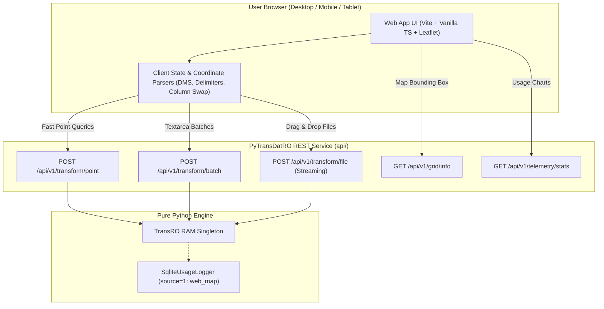
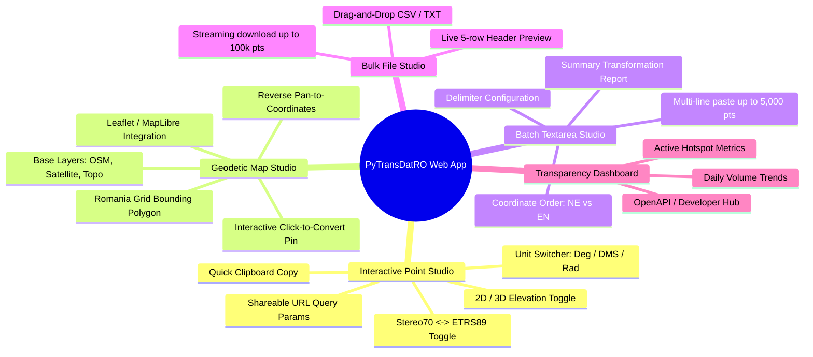
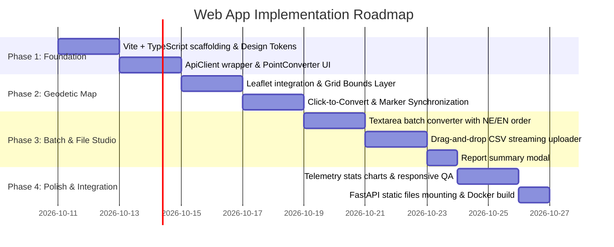

# PyTransDatRO: Web Application Specification & Design Blueprint

## 1. Executive Summary & Vision

This document defines the functional requirements, architectural integration, user experience (UX) modules, and design aesthetics for the **PyTransDatRO Web Application** (`webapp/`).

The web application is the public-facing interactive interface built on top of the **PyTransDatRO REST API** (`api/`). It reimagines the 2012 Java/GWT TransDatOnline portal into a high-performance, mobile-responsive, state-of-the-art Web GIS tool for surveyors, civil engineers, GIS professionals, and the general public.

---

## 2. Architectural Relationship with the REST API

The web application is designed as a **decoupled client** that communicates exclusively with the REST API backend:



### Key Integration Invariants:
1. **Telemetry Source Identification**: All requests initiated by the web app include the HTTP header `X-Client-Source: web_app`, allowing the backend to attribute usage to `source=1` (`web_map`) instead of generic API calls (`source=2`).
2. **Client-Side Ergonomics vs. Server-Side Purity**:
   - The REST API remains purely mathematical (numbers only).
   - The web app handles UI formatting, such as Degrees-Minutes-Seconds (DMS) parsing (`44° 25' 36.48"` $\rightarrow$ decimal degrees) and coordinate column swapping (`NE` vs `EN`).
3. **Deployment Modalities**:
   - **Embedded Mode (Default)**: Built frontend assets (`webapp/dist/`) are served directly by FastAPI via `app.mount("/", StaticFiles(directory="webapp/dist", html=True))`.
   - **Decoupled Mode**: Static assets deployed independently to a CDN (Cloudflare Pages, Vercel, GitHub Pages), connecting to the API via CORS.

---

## 3. Core Functional Modules



---

### Module A: Interactive Point Studio (Single Transformation)
Designed for immediate coordinate verification by field surveyors and cadastral engineers.

* **Direction Switcher**: Seamless toggle between **Stereo 70 $\rightarrow$ ETRS89** and **ETRS89 $\rightarrow$ Stereo 70**, with an instant "Swap / Invert" button.
* **Angular Units Switcher**:
  - **Decimal Degrees** (e.g. `45.9997186°`, `24.9984476°`) – default for web maps.
  - **DMS (Degrees, Minutes, Seconds)** (e.g. `45° 59' 58.99" N`, `24° 59' 54.41" E`) – standard for topographic reports.
  - **Radians** (e.g. `0.802846545 rad`, `0.436305219 rad`) – standard geodetic format.
* **Dimension Toggle (2D vs. 3D)**:
  - 2D mode: $N, E$ or $Lat, Lon$.
  - 3D mode: Adds normal elevation $H$ (Black Sea 1975 datum) or ellipsoidal height $h$ (GRS80/WGS84 ellipsoid).
* **Live Validation & Feedback**:
  - Validates coordinates on blur / enter.
  - Displays instant warning banners if coordinates fall outside the Romanian grid boundary (`Out of grid`).
* **Ergonomic Features**:
  - One-click copy buttons for each coordinate or full tuple.
  - URL Query Parameter Synchronization: Syncs inputs to the browser URL (e.g. `/?op=s70_to_etrs&n=500000&e=500000&z=100`), enabling surveyors to bookmark or share exact points.

---

### Module B: Geodetic Map Studio (Interactive Mapping)
Provides visual spatial context and point dropping on Romanian territory.

* **Map Engine**: Lightweight **Leaflet.js** (or MapLibre GL).
* **Grid Bounds Layer**: Queries `GET /api/v1/grid/info` on startup to render Romania's official TransDat `.spg` bounding envelope as a subtle styled polygon.
* **Click-to-Convert**:
  - Clicking anywhere on the map drops a marker and populates the point converter inputs immediately.
  - If clicked outside the grid boundary, marker turns red with a non-blocking toast: *"Location is outside the official TransDatRO coverage area."*
* **Reverse Pan & Sync**:
  - When coordinates are entered manually into the text inputs, the map smoothly pans and centers on the marker.
* **Base Map Switcher**:
  - CartoDB Dark / Light (clean geodetic look).
  - OpenStreetMap standard.
  - Satellite Ortho-imagery (ESRI World Imagery) for cadastral verification.

---

### Module C: Batch Textarea Studio (Multi-Line Conversion)
Replaces the legacy GWT `CRSPanel` text input for pasting lists of points from spreadsheets or text files.

* **Input & Output Textareas**: Side-by-side or stacked responsive layout with line-number gutters.
* **Coordinate Ordering Options**:
  - `NE(H)`: Northing first, Easting second (Romanian cadastral standard).
  - `EN(H)`: Easting first, Northing second (GIS / CAD convention).
* **Delimiter Support**: Auto-detect, Comma, Semicolon, Tab, or Space.
* **Transformation Execution**: Calls `POST /api/v1/transform/batch` (supports up to 20,000 points in memory).
* **Interactive Transformation Report Modal**:
  - Recreates the legacy `CooOpReport` dialog in modern UI:
    - Total points submitted.
    - Successfully transformed points.
    - Out of grid points (with clickable jump-to-row navigation).
    - Invalid/malformed rows.

---

### Module D: Bulk File Studio (Drag-and-Drop Streaming)
For large cadastral projects, drone survey point clouds, and regional datasets.

* **File Dropzone**: Drag-and-drop `.csv`, `.txt`, `.xyz` files (up to 20 MB / 100,000 points).
* **Smart Detection & Preview**:
  - Reads the first 5 rows client-side.
  - Detects delimiter and suggests column mapping.
  - Allows user to confirm: *"Column 1 = Northing, Column 2 = Easting, Column 3 = Elevation"*.
* **Streaming Download**:
  - Sends a multipart request to `POST /api/v1/transform/file`.
  - Downloads the converted CSV directly via chunked transfer with an animated progress bar.

---

### Module E: Transparency Dashboard & Telemetry
Displays public usage statistics and geodetic information.

* **Public Stats Tab**:
  - Queries `GET /api/v1/telemetry/stats`.
  - Displays daily point and call volume charts (using a lightweight chart library or pure CSS bars).
  - Shows total cumulative points transformed across Romania.
* **Geodetic Technical Card**:
  - Displays active `.spg` grid metadata, Helmert parameters, and quasigeoid model details loaded from `GET /api/v1/grid/info`.

---

### Module F: Developer Hub
* Embedded links to the auto-generated Swagger UI (`/docs`) and ReDoc (`/redoc`).
* Code Snippet Generator: Interactive tab showing how to transform the current coordinates using Python, JavaScript, and cURL.

---

## 4. UI/UX Design System & Aesthetics

The application must convey **scientific precision, geodetic authority, and modern digital craft**:

### A. Color Palette & Theming
* **Dark Mode (Default)**: Deep slate background (`#0B0F19`), elevated card surfaces (`#131B2E`), subtle borders (`#1E293B`).
* **Light Mode**: Crisp off-white (`#F8FAFC`), pure white cards (`#FFFFFF`), light border definition (`#E2E8F0`).
* **Accent Colors**:
  - **Geodetic Cyan / Sapphire** (`#0284C7` / `#38BDF8`): Primary action buttons, active tabs, marker pin.
  - **Emerald Green** (`#10B981`): Valid transformation success badges, download states.
  - **Amber / Crimson** (`#F59E0B` / `#EF4444`): Out of grid boundary warnings, malformed coordinate errors.

### B. Typography
* Primary Sans: **`Inter`** or **`Plus Jakarta Sans`** (clean geometric sans-serif for UI labels and headings).
* Monospace: **`JetBrains Mono`** or **`Fira Code`** (for all numerical coordinates, line gutters, and raw outputs to ensure perfect tabular alignment).

### C. Micro-Interactions & Motion
* Smooth accordion animations when expanding options panels.
* Glassmorphism headers with backdrop blur (`backdrop-filter: blur(12px)`).
* Click-to-copy tactile tooltips (*"Copied!"* fade-in).
* Subtle pulse animation on the map marker when coordinates are updated.

---

## 5. Technical Stack & Implementation Structure

### Technology Choices
1. **Build Tool & Bundler**: **Vite** (blazing fast HMR, zero-config production bundle).
2. **Language**: **Vanilla TypeScript** (type-safe interfaces matching `api/schemas/` models).
3. **Styling**: **Vanilla CSS** with modern CSS custom properties (design tokens, CSS grid, flexbox, zero Tailwind bloat).
4. **Mapping Library**: **Leaflet** (`leaflet@^1.9.4`) with customized dark/light tile layers.

### Project Layout (`webapp/`)
```text
PyTransDatRO/
├── webapp/
│   ├── index.html                  # Main SPA entrypoint
│   ├── package.json                # Vite & Leaflet dependencies
│   ├── tsconfig.json               # TypeScript configuration
│   ├── vite.config.ts              # Vite build setup (proxies /api to localhost:8000)
│   ├── public/
│   │   ├── favicon.svg
│   │   └── romania_boundary.geojson# Optional client-side boundary polygon
│   └── src/
│       ├── main.ts                 # App bootstrapping & theme setup
│       ├── style/
│       │   ├── variables.css       # Design tokens (colors, fonts, shadows)
│       │   ├── base.css            # Typography, resets, layout grid
│       │   ├── components.css      # Buttons, inputs, tabs, cards, toasts
│       │   └── map.css             # Leaflet custom marker & control overrides
│       ├── components/
│       │   ├── Header.ts           # Navbar, theme toggle, API docs link
│       │   ├── PointConverter.ts   # Module A: Single point interactive UI
│       │   ├── MapView.ts          # Module B: Leaflet geodetic map
│       │   ├── BatchConverter.ts   # Module C: Textarea multi-point UI
│       │   ├── FileUpload.ts       # Module D: Drag & drop file streaming
│       │   ├── ReportModal.ts      # Transformation summary report
│       │   └── StatsView.ts        # Module E: Telemetry & stats dashboard
│       └── utils/
│           ├── apiClient.ts        # Fetch wrapper for /api/v1 endpoints
│           ├── dmsParser.ts        # Degrees <-> DMS <-> Radians converters
│           └── clipboard.ts        # Copy helpers and toast notifications
```

---

## 6. Phased Implementation Roadmap (For Future Session)



---

## 7. Entry Point Instructions for the Implementation Agent

When starting a new session to build the web app:
1. Review this document ([`specs/web_app.md`](specs/web_app.md)) alongside the REST API specification ([`specs/rest_api.md`](specs/rest_api.md)).
2. Initialize the Vite TypeScript project inside `webapp/`:
   ```bash
   npm create vite@latest webapp -- --template vanilla-ts
   ```
3. Install Leaflet and types:
   ```bash
   cd webapp && npm install leaflet && npm install -D @types/leaflet
   ```
4. Configure `webapp/vite.config.ts` with an API proxy pointing `/api` to `http://localhost:8000`.
5. Ensure the application mounts cleanly into FastAPI for production via `FastAPI.mount("/", StaticFiles(directory="webapp/dist", html=True))`.
