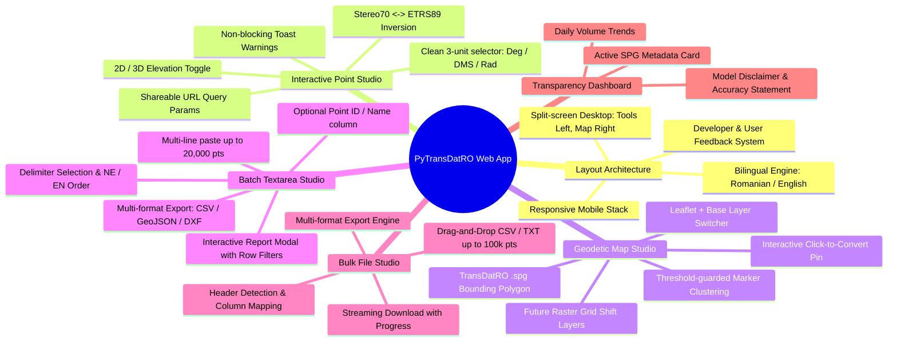
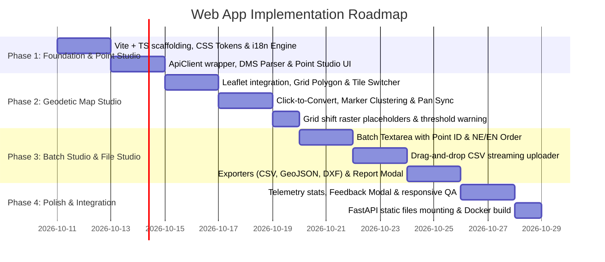

# PyTransDatRO: Web Application Specification & Design Blueprint

## 1. Executive Summary & Vision

This document defines the functional requirements, architectural integration, user experience (UX) modules, and design aesthetics for the **PyTransDatRO Web Application** (`webapp/`).

The web application is the public-facing interactive interface built on top of the **PyTransDatRO REST API** (`api/`). It reimagines the 2012 Java/GWT TransDatOnline portal into a high-performance, mobile-responsive, state-of-the-art Web GIS tool for surveyors, civil engineers, GIS professionals, and the general public.

---

## 2. Architectural Relationship with the REST API

The web application is designed as a **decoupled client** that communicates exclusively with the REST API backend:

```mermaid
flowchart TD
    subgraph Browser["User Browser (Desktop / Mobile / Tablet)"]
        UI["Web App UI (Vite + Vanilla TS + Leaflet)"]
        ClientState["Client State & Parsers (i18n RO/EN, Point ID, DMS, Delimiters, Column Swap)"]
        ExportEngine["Client-Side Export Engine (CSV, GeoJSON, DXF)"]
        ClusteredLayer["Leaflet.markercluster Engine (Batch/File Geo-Plotting)"]
        FeedbackModal["User Feedback & Discrepancy Reporting Form"]
    end

    subgraph API["PyTransDatRO REST Service (api/)"]
        PointRoute["POST /api/v1/transform/point"]
        BatchRoute["POST /api/v1/transform/batch"]
        FileRoute["POST /api/v1/transform/file (Streaming)"]
        GridInfo["GET /api/v1/grid/info"]
        StatsRoute["GET /api/v1/telemetry/stats"]
    end

    subgraph Core["Pure Python Engine"]
        TransRO["TransRO RAM Singleton"]
        Telemetry["SqliteUsageLogger (source=1: web_map)"]
    end

    UI --> ClientState
    ClientState -->|Fast Point Queries| PointRoute
    ClientState -->|Textarea Batches (Coords only)| BatchRoute
    ClientState -->|Drag & Drop Files| FileRoute
    UI -->|Map Bounding Box| GridInfo
    UI -->|Usage Charts| StatsRoute
    UI --> ExportEngine
    UI --> ClusteredLayer
    UI --> FeedbackModal

    PointRoute & BatchRoute & FileRoute --> TransRO
    TransRO -.-> Telemetry
```

### Key Integration Invariants:
1. **Telemetry Source Identification**: All requests initiated by the web app include the HTTP header `X-Client-Source: web_app`, allowing the backend to attribute usage to `source=1` (`web_map`) instead of generic API calls (`source=2`).
2. **Client-Side Ergonomics vs. Server-Side Purity**:
   - The REST API remains purely mathematical (numbers only).
   - The web app client handles all UI abstractions:
     - Point ID / Name column extraction, preservation, and re-attachment.
     - Degrees-Minutes-Seconds (DMS) parsing (`44° 25' 36.48"` $\rightarrow$ decimal degrees).
     - Coordinate column swapping (`NE` vs `EN`).
     - Multi-format file export generation (CSV, GeoJSON, AutoCAD DXF) in pure client-side TypeScript.
     - Bilingual text translation (`RO` / `EN`).
3. **Deployment Modalities**:
   - **Embedded Mode (Default)**: Built frontend assets (`webapp/dist/`) are served directly by FastAPI via `app.mount("/", StaticFiles(directory="webapp/dist", html=True))`.
   - **Decoupled Mode**: Static assets deployed independently to a CDN (Cloudflare Pages, Vercel, GitHub Pages), connecting to the API via CORS.

---

## 3. Core Functional Modules & User Interface Layout

### Primary Layout Architecture: Desktop Split-Screen
* **Desktop View**: Split-screen workbench:
  - **Left / Primary Panel**: Tabbed utility studio housing **Single Point**, **Batch Textarea**, **Bulk File**, and **Telemetry Stats**.
  - **Right Panel**: Full-height interactive **Leaflet Map Studio** providing persistent spatial grounding across all tabs.
* **Mobile / Tablet View**: Responsive single-column flow with a fluid tab switcher between the Utility Studio and the Map Studio.
* **Header / Navigation Bar**:
  - Brand identity (`PyTransDatRO` badge and version tag).
  - Dark / Light mode toggle.
  - **Feedback & Discrepancy Action**: Button opening the **Feedback Modal** (to report suspected coordinate discrepancies or suggest new format support).
  - **Bilingual Switcher**: Instant toggle between Romanian (`RO`, default) and English (`EN`), persisting selection in `localStorage`.
  - Direct links to Developer Hub & OpenAPI Swagger UI (`/docs`).



---

### Module A: Interactive Point Studio (Single Transformation)
Designed for immediate coordinate verification by field surveyors, cadastral engineers, and GIS users.

* **Supported Operations**:
  - **Stereo 70 $\rightarrow$ ETRS89** (EPSG:31700 $\rightarrow$ EPSG:4258 / WGS84).
  - **ETRS89 $\rightarrow$ Stereo 70** (EPSG:4258 / WGS84 $\rightarrow$ EPSG:31700).
  - *Clean Deprecation*: The obsolete Stereo 30 coordinate system from the legacy 2012 app is completely omitted from the modern UI.
  - Seamless "Invert Direction" button swapping source and target inputs instantly.
* **Angular Units Switcher (Clean 3-Item List for ETRS89)**:
  - **Decimal Degrees** (e.g. `45.9997186°`, `24.9984476°`) – default for web maps.
  - **DMS (Degrees, Minutes, Seconds)** (e.g. `45° 59' 58.99" N`, `24° 59' 54.41" E`) – standard for topographic reports.
  - **Radians** (e.g. `0.802846545 rad`, `0.436305219 rad`) – standard geodetic format.
  - *Extensibility Policy*: The angular unit list is kept strictly to these 3 items to avoid clutter. Any user requests for alternative formats (e.g. DDM, Total Station DD.MMSS) are gathered via the Feedback Modal before inclusion.
* **Dimension Toggle (2D vs. 3D)**:
  - 2D mode: $N, E$ or $\text{Lat}, \text{Lon}$.
  - 3D mode: Adds normal elevation $H$ (Black Sea 1975 datum) or ellipsoidal height $h$ (GRS80/WGS84 ellipsoid).
* **Live Validation & Feedback**:
  - Real-time validation on input change/blur.
  - **Non-blocking Toast Notification**: When coordinates fall outside Romania's grid boundary (`Out of grid`), a subtle amber toast notification appears (*"Location is outside the official TransDatRO coverage area"*), while echoing the unshifted coordinates without crashing the UI.
* **Ergonomic Features**:
  - One-click copy buttons for individual coordinates or full coordinate strings.
  - **Shareable URL Query Parameters**: Synchronizes inputs to the browser address bar (e.g. `/?op=Stereo70ToETRS89&n=500000&e=500000&z=100`), enabling surveyors to bookmark or share exact coordinates via URL.

---

### Module B: Geodetic Map Studio (Interactive Mapping & Spatial Grounding)
Provides visual spatial context and point dropping on Romanian territory.

* **Map Engine**: **Leaflet.js** (`leaflet@^1.9.4`) with **Leaflet.markercluster** (`leaflet.markercluster@^1.5.3`).
* **Official Grid Boundary Layer**:
  - Fetches Romania's official `.spg` bounding box polygon from `GET /api/v1/grid/info` on startup.
  - Rendered as a styled semi-transparent polygon outlining national geodetic coverage.
* **Interactive Click-to-Convert**:
  - Clicking anywhere on the map drops a geodetic marker pin and automatically populates the Point Studio inputs.
  - If clicked outside the grid boundary, marker turns red and an alert toast is shown.
* **Reverse Pan & Sync**:
  - Typing or changing coordinates in the Point Studio smoothly centers and pans the map to the target location.
* **Batch & Bulk Point Visualization with Pre-Warning**:
  - Plots points on the map using **Leaflet.markercluster**.
  - **High-Volume Threshold Pre-Warning**:
    - When batch size exceeds **2,000 points**, the app displays an explicit pre-warning dialog before rendering markers:
      > *"You are about to display [N] points on the interactive map. Depending on your device, rendering this many points simultaneously may cause the browser to freeze or become sluggish."*
    - The user can select:
      1. **Proceed with full display** (accepting browser load).
      2. **Disable map display** for this batch (keeping results in table/export only).
      3. **Display a reduced sample** (e.g., first 1,000 points).
* **Base Map Switcher & Distortion Grid Raster Placeholders**:
  - **Standard Base Layers**:
    - OpenStreetMap (default).
    - CartoDB Dark / Light (sleek geodetic theme).
    - Satellite Ortho-imagery (ESRI World Imagery) for cadastral verification.
  - **Geodetic Grid Shift Raster Layers (Placeholders for upcoming map services)**:
    - Built into the map layer control as toggleable overlays:
      1. *East Grid Shifts ($\Delta E$)*.
      2. *North Grid Shifts ($\Delta N$)*.
      3. *Total Horizontal Vector Shift ($\Delta E + \Delta N$)*.
      4. *Quasigeoid Elevation Shifts ($\Delta H$ / $\zeta$)*.
    - Initially rendered with a clean "Coming Soon / În curând" layer indicator until raster services are published.

---

### Module C: Batch Textarea Studio (Multi-Line Conversion)
Modernizes and replaces the legacy GWT `CRSPanel` text interface for spreadsheets and clipboard point lists.

* **Input & Output Textareas**: Responsive side-by-side or stacked layout with monospace line-number gutters.
* **Point Identifier (Point ID / Name) Support**:
  - Automatically supports optional point names or numeric IDs as the first column:
    ```text
    101, 500000.000, 500000.000, 100.000
    102, 500120.450, 500340.120, 102.300
    ```
  - The client parser strips and preserves the Point ID client-side, passes pure numeric coordinates to `POST /api/v1/transform/batch`, and prepends the ID to the resulting output line.
* **Coordinate Ordering Options**:
  - `NE(H)`: Northing first, Easting second (Romanian cadastral standard).
  - `EN(H)`: Easting first, Northing second (GIS / CAD convention).
* **Delimiter Configuration**:
  - Auto-detect, Comma, Semicolon, Tab, or Space.
  - Output delimiter matches the user's selected delimiter.
* **Multi-Format Export Suite (Client-Side Generation)**:
  - **Download CSV**: Standard delimited text file.
  - **Download GeoJSON**: Formatted spatial FeatureCollection with Point ID and elevation attributes for immediate use in QGIS or ArcGIS.
  - **Download AutoCAD DXF**: Lightweight ASCII DXF file containing `POINT` and `TEXT` annotations (Point ID, elevation) for instant opening in AutoCAD and Civil 3D.
* **Interactive Transformation Report Modal**:
  - Upgrades the legacy `CooOpReport` dialog:
    - **Total Points Processed**.
    - **Valid & Transformed Points** (Emerald Green).
    - **Points Outside Grid (`Out of grid`)** (Amber Warning).
    - **Malformed / Invalid Rows** (Crimson Error).
  - **Interactive Filter & Jump**: Clicking on the *"Invalid Rows"* or *"Out of grid"* card in the modal filters the output view to jump directly to offending rows.

---

### Module D: Bulk File Studio (Drag-and-Drop Streaming)
For large cadastral projects, drone survey point clouds, and regional datasets up to 100,000 points.

* **File Dropzone**: Drag-and-drop `.csv`, `.txt`, `.xyz` files (up to 20 MB).
* **Smart Detection & 5-Row Preview**:
  - Reads the first 5 rows client-side before upload.
  - Detects delimiter and presents an interactive column mapper:
    *"Col 1: Point ID | Col 2: Northing | Col 3: Easting | Col 4: Elevation"*.
* **Streaming Chunked Download**:
  - Dispatches multipart request to `POST /api/v1/transform/file`.
  - Downloads the converted CSV directly via HTTP streaming transfer with an animated progress bar.
* **Multi-Format File Export**:
  - In addition to streaming CSV, the client supports generating **GeoJSON** and **AutoCAD DXF** downloads for the converted dataset.
* **Map Plotting Toggle**:
  - Threshold-guarded toggle to plot points on the Leaflet map (subject to the high-volume pre-warning).

---

### Module E: Transparency Dashboard, Metadata & Developer Feedback

* **Public Stats Tab**:
  - Queries `GET /api/v1/telemetry/stats`.
  - Displays daily point and call volume charts (pure CSS bars or SVG sparklines).
  - Shows total cumulative points transformed across Romania.
* **Geodetic Technical Card & Grid Metadata**:
  - Displays active `.spg` grid metadata, Helmert parameters, and quasigeoid model details loaded from `GET /api/v1/grid/info`.
  - **Official Accuracy & Methodology Notice**:
    - Transformation Model: *TransDatRO v4.06 (Bicubic Spline + Helmert 2D)*.
    - Quasigeoid Model: *Modelul de Cvasigeoid Românesc 2008 / EGG97*.
    - Empirical Accuracy: *Horizontal $\approx 2\text{--}5\text{ cm}$; Vertical $\approx 3\text{--}7\text{ cm}$ within grid perimeter*.
* **Discrepancy Reporting & User Feedback Action**:
  - Prominent action button: **"Report Discrepancy / Raportează o neconcordanță"**.
  - Opens a feedback modal allowing surveyors to:
    1. Report a suspected transformation discrepancy (e.g. comparing with desktop TransDat or national GNSS stations).
    2. Suggest new coordinate formats or feature enhancements.
    3. Notifies maintainers directly with user-submitted coordinates and browser metadata.

---

### Module F: Developer Hub
* Embedded links to auto-generated OpenAPI Swagger UI (`/docs`) and ReDoc (`/redoc`).
* Code Snippet Generator: Interactive tab generating ready-to-use Python (`requests`), JavaScript (`fetch`), and cURL commands for the currently entered coordinates.

---

## 4. UI/UX Design System & Aesthetics

The application must convey **scientific precision, geodetic authority, and modern digital craft**:

### A. Color Palette & Theming
* **Dark Mode (Default)**: Deep slate background (`#0B0F19`), elevated card surfaces (`#131B2E`), subtle borders (`#1E293B`).
* **Light Mode**: Crisp off-white (`#F8FAFC`), pure white cards (`#FFFFFF`), light border definition (`#E2E8F0`).
* **Accent Colors**:
  - **Geodetic Cyan / Sapphire** (`#0284C7` / `#38BDF8`): Primary action buttons, active tabs, marker pin.
  - **Emerald Green** (`#10B981`): Valid transformation success badges, download states.
  - **Amber / Crimson** (`#F59E0B` / `#EF4444`): Out of grid boundary warnings, malformed coordinate errors.

### B. Typography
* Primary Sans: **`Inter`** or **`Plus Jakarta Sans`** (clean geometric sans-serif for UI labels and headings).
* Monospace: **`JetBrains Mono`** or **`Fira Code`** (for all numerical coordinates, line gutters, and raw outputs to ensure perfect tabular alignment).

### C. Internationalization (i18n)
* Built-in dictionary support for **Romanian (`ro`)** and **English (`en`)**:
  - Romanian default matching the national geodetic infrastructure.
  - English toggle for international GIS and surveying practitioners.
  - Stored in `localStorage` under `pytransdat_lang`.

---

## 5. Technical Stack & Implementation Structure

### Technology Choices
1. **Build Tool & Bundler**: **Vite** (blazing fast HMR, zero-config production bundle).
2. **Language**: **Vanilla TypeScript** (type-safe interfaces matching `api/schemas/` models).
3. **Styling**: **Vanilla CSS** with modern CSS custom properties (design tokens, CSS grid, flexbox, zero Tailwind bloat).
4. **Mapping & Spatial Visualization**:
   - **Leaflet** (`leaflet@^1.9.4`) with customized dark/light tile layers.
   - **Leaflet.markercluster** (`leaflet.markercluster@^1.5.3`).

### Project Layout (`webapp/`)
```text
PyTransDatRO/
├── webapp/
│   ├── index.html                  # Main SPA entrypoint
│   ├── package.json                # Vite, Leaflet & Leaflet.markercluster dependencies
│   ├── tsconfig.json               # TypeScript configuration
│   ├── vite.config.ts              # Vite build setup (proxies /api to localhost:8000)
│   ├── public/
│   │   ├── favicon.svg
│   │   └── romania_boundary.geojson# Optional client-side boundary polygon fallback
│   └── src/
│       ├── main.ts                 # App bootstrapping, theme & language setup
│       ├── i18n/
│       │   ├── ro.ts               # Romanian dictionary (default)
│       │   ├── en.ts               # English dictionary
│       │   └── index.ts            # i18n helper & language observer
│       ├── style/
│       │   ├── variables.css       # Design tokens (colors, fonts, shadows)
│       │   ├── base.css            # Typography, resets, split layout grid
│       │   ├── components.css      # Buttons, inputs, tabs, cards, modals, toasts
│       │   └── map.css             # Leaflet custom marker & cluster overrides
│       ├── components/
│       │   ├── Header.ts           # Navbar, theme toggle, i18n toggle, feedback button
│       │   ├── PointConverter.ts   # Module A: Single point interactive UI
│       │   ├── MapView.ts          # Module B: Leaflet map, cluster manager & grid raster overlays
│       │   ├── BatchConverter.ts   # Module C: Textarea multi-point UI + Point ID
│       │   ├── FileUpload.ts       # Module D: Drag & drop file streaming
│       │   ├── ReportModal.ts      # Transformation summary report modal
│       │   ├── FeedbackModal.ts    # Module E: Discrepancy reporting & user feedback
│       │   └── StatsView.ts        # Module E: Telemetry & stats dashboard
│       └── utils/
│           ├── apiClient.ts        # Fetch wrapper for /api/v1 endpoints
│           ├── dmsParser.ts        # Degrees <-> DMS <-> Radians converters
│           ├── pointParser.ts      # Line parser extracting Point ID, Coords & Order
│           ├── exporters.ts        # Multi-format exporters: CSV, GeoJSON, AutoCAD DXF
│           └── toast.ts            # Non-blocking notification toasts
```

---

## 6. Phased Implementation Roadmap



---

## 7. Entry Point Instructions for the Implementation Agent

When starting a new session to build the web app:
1. Review this document ([`specs/web_app.md`](specs/web_app.md)) alongside the REST API specification ([`docs/rest_api.md`](docs/rest_api.md)) and legacy client analysis ([`docs/transdatonline/05_legacy_client_functionality_and_validation.md`](docs/transdatonline/05_legacy_client_functionality_and_validation.md)).
2. Initialize the Vite TypeScript project inside `webapp/`:
   ```bash
   npm create vite@latest webapp -- --template vanilla-ts
   ```
3. Install Leaflet, MarkerCluster, and types:
   ```bash
   cd webapp && npm install leaflet leaflet.markercluster && npm install -D @types/leaflet @types/leaflet.markercluster
   ```
4. Configure `webapp/vite.config.ts` with an API proxy pointing `/api` to `http://localhost:8000`.
5. Ensure the application mounts cleanly into FastAPI for production via `FastAPI.mount("/", StaticFiles(directory="webapp/dist", html=True))`.
